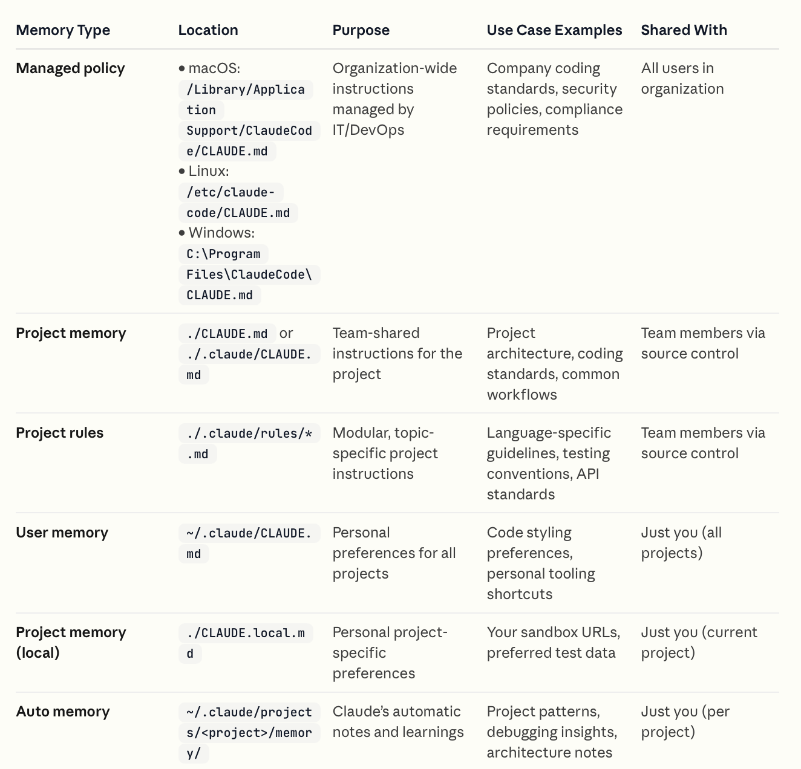
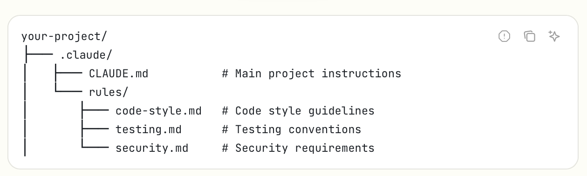
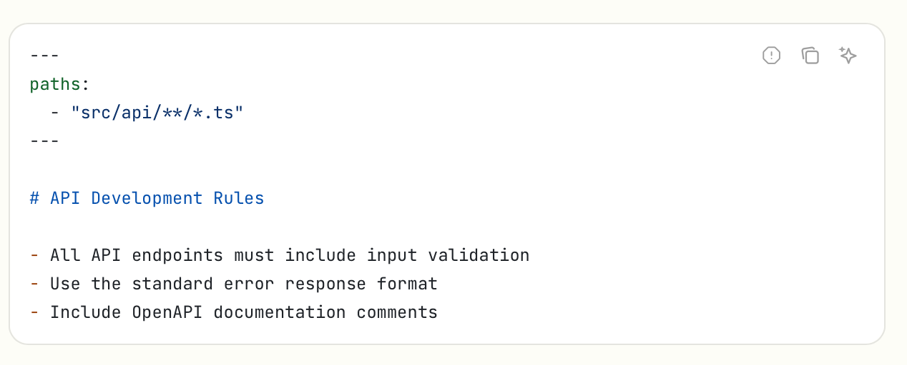
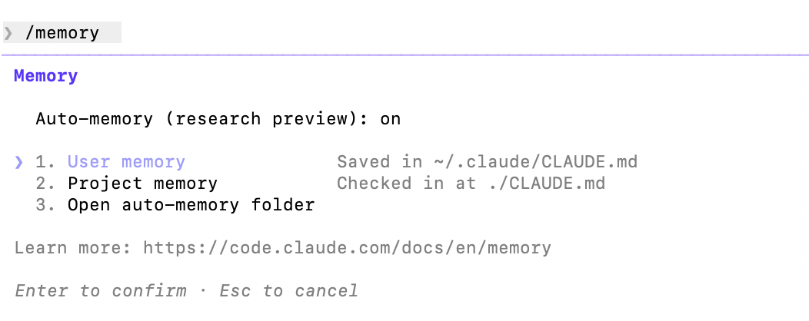

[toc]

##### What is it

[Documentation](https://code.claude.com/docs/en/memory)

The idea with **CLAUDE.md** file is that it is persistent memory automatically loaded in every session/CW. There are various levels of this file which then dictate if that file is loaded across all projects, or just particular ones, and even in some specific folders in projects.

##### Official Summary



##### My Summary

| File                                                  | Use                                                          |
| ----------------------------------------------------- | ------------------------------------------------------------ |
| **/Library/Application Support/ClaudeCode/CLAUDE.md** | Across all projects (all systems, company managed)           |
| **~/.claude/CLAUDE.md**                               | Across all projects (only in one system, user managed)       |
| **~/.claude/rules/*.md**                              | Across all projects (only in one system, user managed)       |
|                                                       |                                                              |
| **./CLAUDE.md <br>** **./.claude/CLAUDE.md**          | Project specific instructions (push to GH)                   |
| **./.claude/rules/*.md**                              | Project specific instructions split across files (push to GH) |
|                                                       |                                                              |
| **~/.claude/projects/<project>/memory/**              | Claude's automatic generation, probably not editable         |
|                                                       |                                                              |
| **./CLAUDE.local.md** (decommissioned)                | Project specific instructions (user managed)                 |

##### Files in rules directory

When there are path or extension specific rules to follow, they can be put in **rules** directory with the paths that thet need to apply to specified in `paths` frontmatter field. If the `paths` is not specified, the putting things in rules rather serves an organizational purpose only as all the content still gets loaded along with CLAUDE.md ([Documentation](https://code.claude.com/docs/en/memory#organize-rules-with-claude/rules/))



Also these files can specify (in YAML format) the extensions that they should apply to on top through **paths** key. GLOB patterns are allowed there too. As are symlinks to other files. ([link](https://code.claude.com/docs/en/memory#symlinks))



There can be rules folder at user level too, i.e. in `~/.claude/rules/` so that they apply to all projects.

##### When are these files loaded

`CLAUDE.md` and `CLAUDE.local.md` files up the directory tree are loaded at launch time.

`CLAUDE.md` and `CLAUDE.local.md` files in subdirectories under your current working directory are loaded only when the files in those subdirectories are read.

md files in .claude/rules are loaded as per their paths frontmatter field.

**Auto memory** (i.e. ~/.claude/projects/<project>/memory/) loads only its first 200 lines.

##### /init

This basically creates a project level CLAUDE.md file if none exists, and populates it with details that CLAUDE has learnt about the project.

##### /memory

While you can of course edit these markdown files yourself, **/memory** too can be used. Note how it also gives you an option to open the auto-memory folder.



##### Referencing additional files

Within CLAUDE.md, additional files can be imported using **@path/to/import** syntax.

Here is a sample.

```
See @README for project overview and @package.json for available npm commands for this project.

# Additional Instructions
- git workflow @docs/git-instructions.md
```

