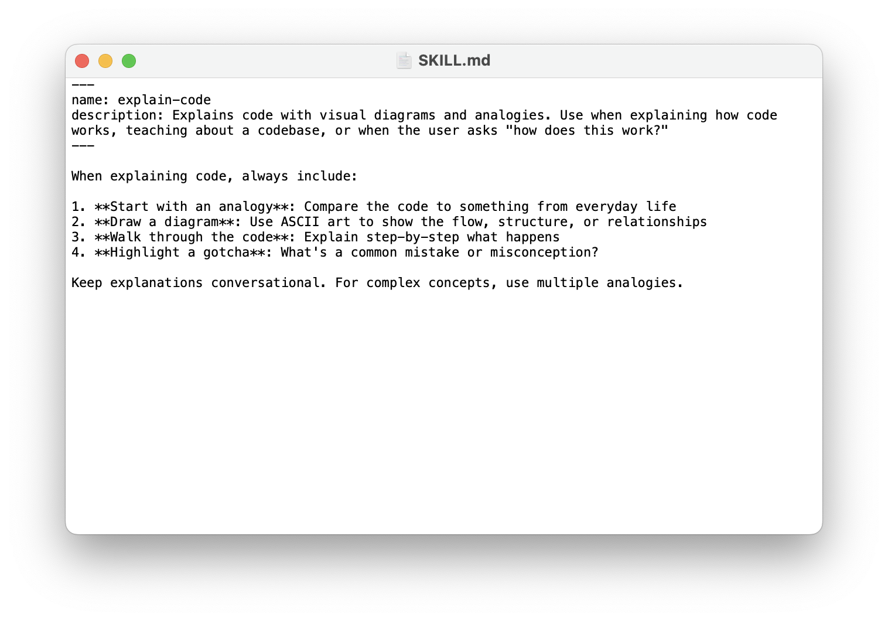
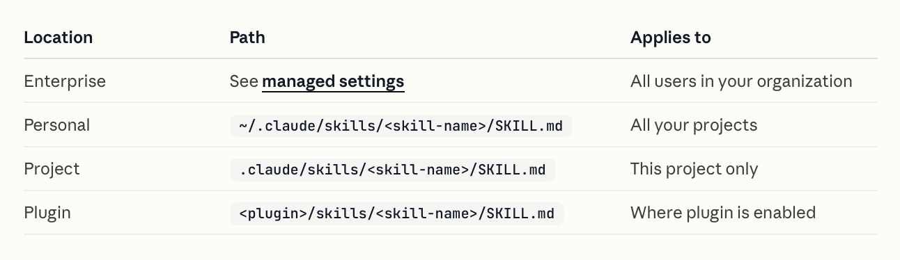
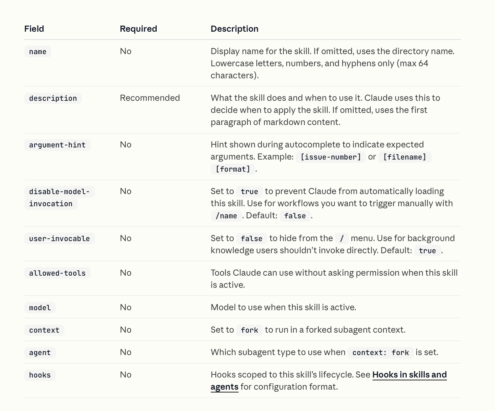
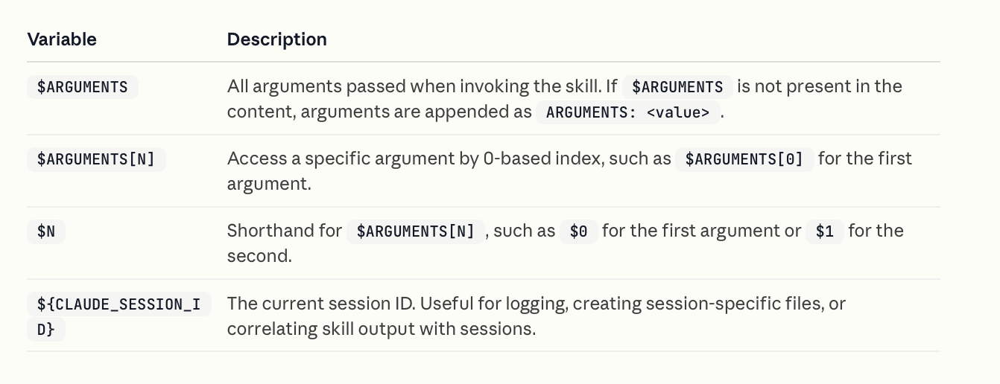
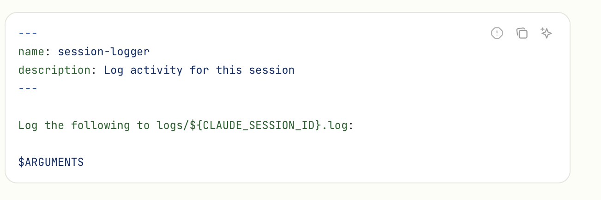
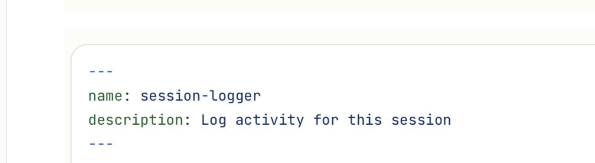
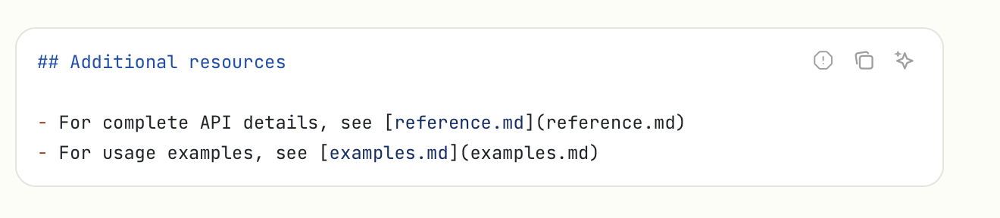
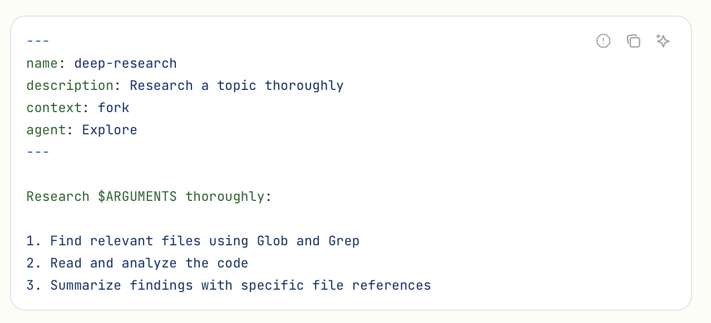

[toc]

Simply put **Skills** are descriptive custom instructions that you can invoke with a slash command syntax. 

[Documentation](https://code.claude.com/docs/en/skills)

All the available skills can be viewed using **/skills**

##### What the SKILL.md file looks like

The name of the skill and the description need to be given in the top (frontmatter). The **name** is what can be specified later in skash command, and **description** explains what it does so that Claude can invoke this for any prompt that Claude feels can be handled by this skill. And then the full instructions follow.

The below skill can explain any code using diagrams.



> Keep the core SKILL.md file under 500 lines.

##### Invocation

It an be invoke either of these ways. The exact skill name as a slash command, or even a general prompt. Its not mandatory to pass any arguments. For example, here it will still try to infer which file you might be referring to and work.

```
❯ /explain-code InsightsNative/ContentView.swift

❯ How does this code work                                                                                   
```

If however the SKILL.md has the **disable-model-invocation: true** flag in its frontmatter, it is never triggered inferringly and is only triggered when invoked directly.

```
---
name: deploy
description: Deploy the application to production
context: fork
disable-model-invocation: true
---
```


##### Where to put it

A folder with the skill's name needs to be created and then a **SKILL.md** file created within it. Just like CLAUDE.md, there are many different possible places for SKILL.md too depending on how widely that skill has to be available.

 

##### Discovering skills from additional directories

Skills can even be put in non-standard places outside project root or ~/.claude/skills/, etc.. Its just that claude should then be started with **--add-dir** option. There onwards skills in those directories are avilable too, and even any changes made to those skills even after a session has started become available.

```
claude --add-dir ~/claude-shared --add-dir ~/work/ios-utils
```

##### Frontmatter flags




##### Using arguments passed to the skill

Its possible to pass some arguments to the skill during invocation and have the skill then use it in some fashion.





##### Splitting into multiple files

Its possible to split a SKILL.md into multiple files and just add their references in SKILL.md's contents. That way the entire thing is not necessarily loaded at skill invocation but maybe only when really needed.



These references can then be in normal markdown hyperlink format.



##### Injecting dynamic content from shell output

The below format can be used inside a SKILL.md to get dynamic content by running a shell command live. `!`  followed by shell command wrapped in backticks, i.e.

```
## Pull request context
- PR diff: !`gh pr diff`
- PR comments: !`gh pr view --comments`
```

##### Forcing context isolation

Putting the following in frontmatter, forces the skill to be run in a subagent fork that does not have access to previous CH (Conversation History). This can be useful if the skill is heavy enough that giving it even the existing CH will make things too complicated for it.

```
context: fork
```



##### Selectively turning off skills

This can be done through **/permissions** or **permission rules**.

```
# Add to deny rules:
Skill

# Allow only specific skills
Skill(commit)
Skill(review-pr *)

# Deny specific skills
Skill(deploy *)
```