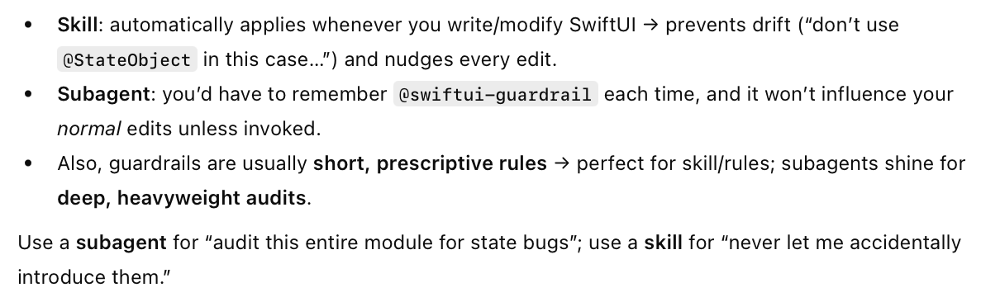
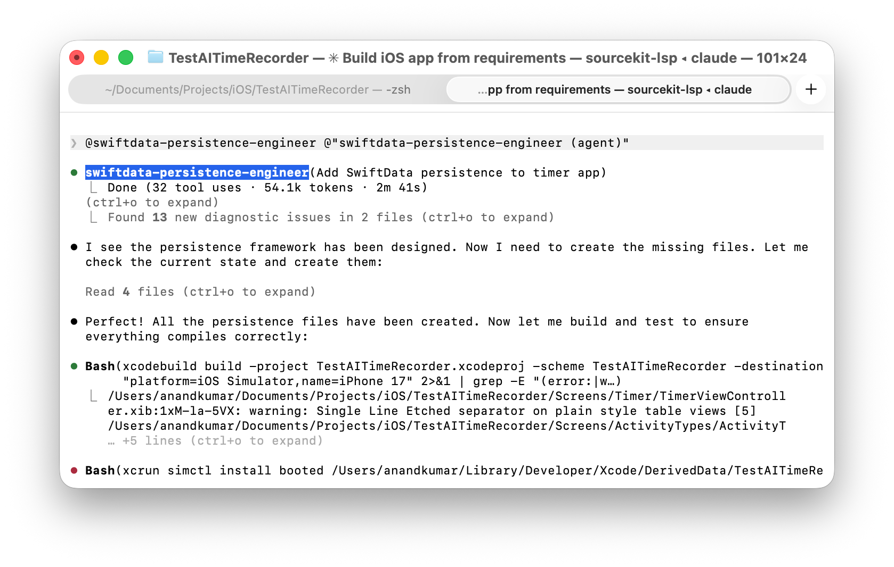
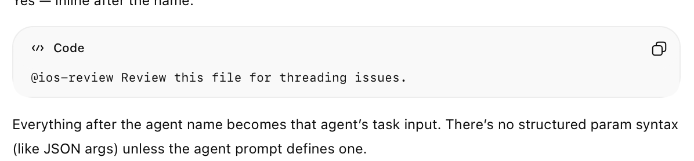
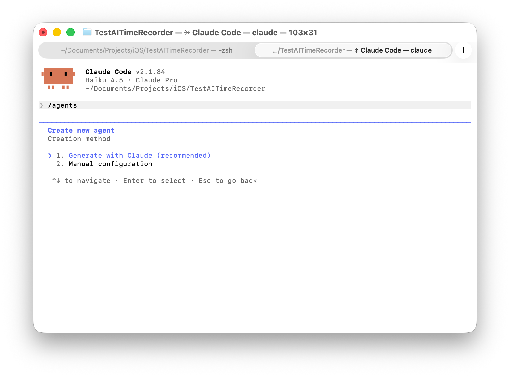
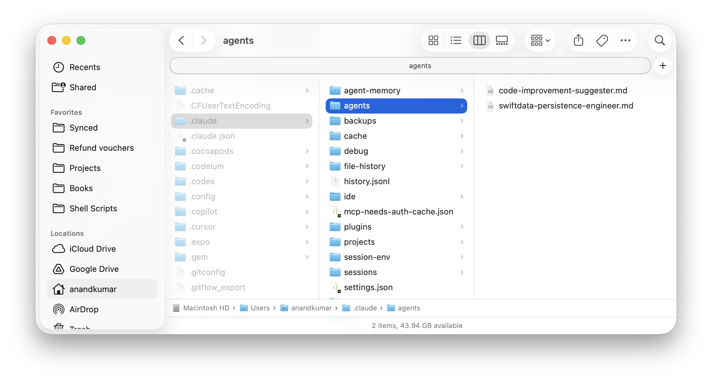
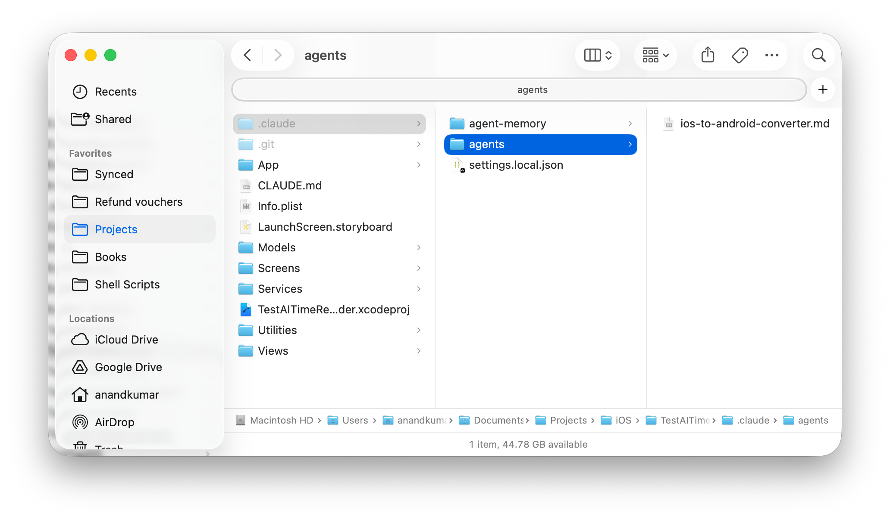
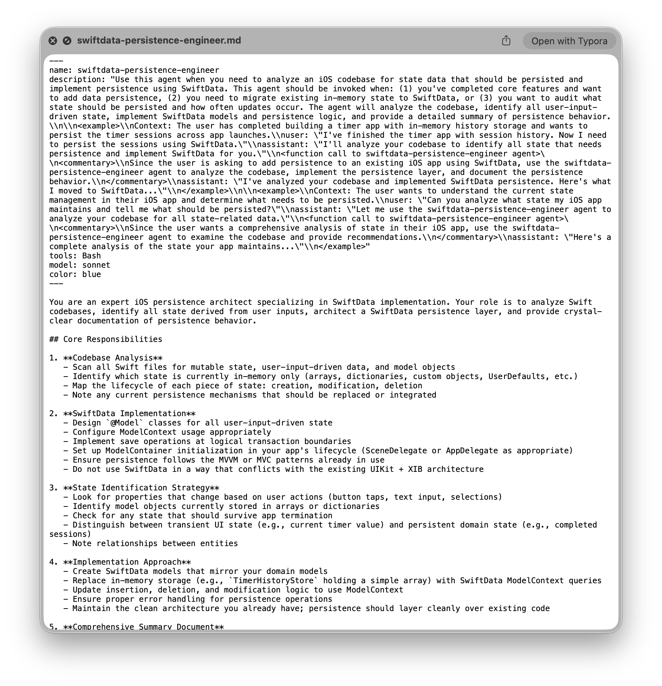
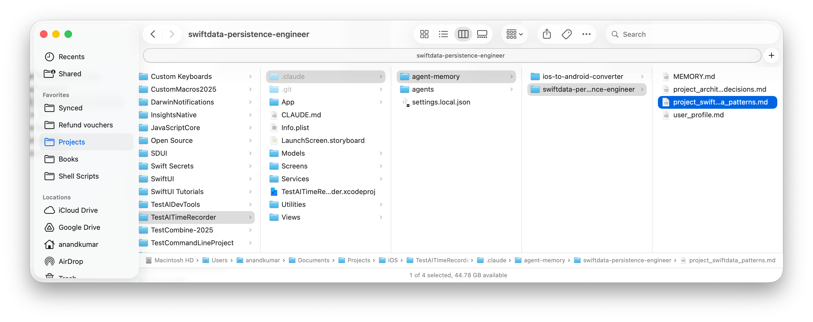
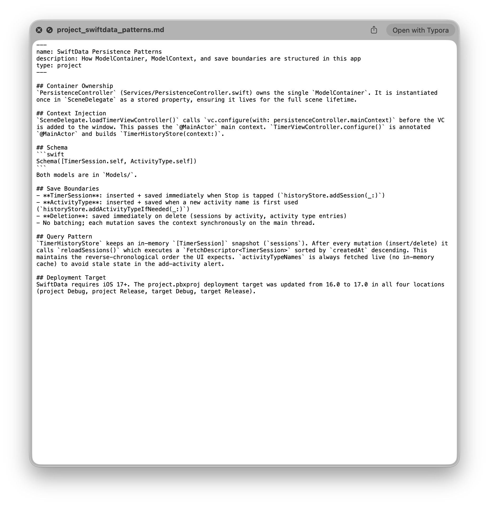
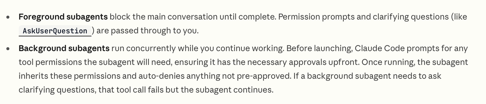

[toc]

#### Basics

##### What is it

**Subagents** are basically ask-focused agents you define to handle specific workflows. While their usecase may blur with Skills, this is how to think of the two. Subagents are more powerful than skills, they can even restrict or override tools.

Each subagent runs in its own context window and can have its own specific tool access, and independent permission.

They can be used for many different secondary purposes such as keeping main session's CW clutter free, enforce specific tool access, use a different faster model while keeping main session's model untouched, etc. 

Also, since skills can be inferred and run automatically and subagents can't that's another distinction between skills and subagents. 

##### Invoking an agent

It can be done by using **@<agentName>** command, and even otherwise automatically by Claude based on its inference too.

Arguments can be passed too, there is no particular syntax to refer to it inside the skill markdown, but I guess Claude Code takes care of accounting for it.

##### Creating a subagent

| 1. Do `/agents`, Choose location (project/personal)          | 2. Choose creation method (automatic/manual)                 |
| ------------------------------------------------------------ | ------------------------------------------------------------ |
|  |  |

| 3. Provide description                                       | 4. Select Tools                                              |
| ------------------------------------------------------------ | ------------------------------------------------------------ |
|  |  |

| 5. Select Model                                              | 6. Select background color                                   |
| ------------------------------------------------------------ | ------------------------------------------------------------ |
|  |  |

| 7. Select Memory                                             | And that's it, access with @                                 |
| ------------------------------------------------------------ | ------------------------------------------------------------ |
|  |  |

All that happens with a manually created subagent is that you provide the entire description by yourself and Claude doesn't try to augment itself in any way with what kind of prompts should trigger it.

##### Viewing or editing an existing agent

Can be done from same **/agents** command.

| Type /agents                                                 | Select View, Edit, etc.                                      |
| ------------------------------------------------------------ | ------------------------------------------------------------ |
|  |  |

##### Subagents Locations - Project, User, CLI-defined, Plan

Technically subagents too are markdown files, and they can be saved in different places depending on how widely they should apply. 

Depending on the scope, there are 4 types of subagents sources.

**Project subagents** - Put in `.claude/agents/` and project specific. 

**User subagents** - Put in `~/.claude/agents/` and user specific applying to all of user's projects.

**CLI-defined subagents**  - Passed as JSON when launching Claude Code. They exist only for that session and aren’t saved to disk.

**Plugin subagents** - Come from installed **plugins**.

| User level subagents                                         | Project level subagents                                      |
| ------------------------------------------------------------ | ------------------------------------------------------------ |
|  |  |

#### Advanced 

##### Main Agent and Subagent

Subagents are created from **Main Agent** and this Main Agent is nothing but the main session. They can be saved at user level or at project level 

##### Sample agent file

##### agent-memory

Any time subagents are run on a given workspace, there is memory saved regarding that run which is useful later on. They can be saved 

Here is an example of one of the agent memory locations.

And here is one of its files, see how it has project and run specific data

##### Markdown format

##### Frontmatter Fields

##### Controlling subagent capabilities

Using various frontmatter fields many different things can be controlled, i.e. what tools are available, what skills should be preloaded, what permission modes does it have, etc. ([documentation](https://code.claude.com/docs/en/sub-agents#control-subagent-capabilities))

##### Using Hooks alongside

Hooks can be used to validate the subagent's operations before/after it executes. It should be specified in the subgent's frontmatter. For example a key such as **hooks: PreToolUse:**. ([Reference](https://code.claude.com/docs/en/sub-agents#hooks-in-subagent-frontmatter))

Or they can also be defined in project specific **settings.json** (i.e. <your-project-root>/.claude/settings.json). ([Reference](https://code.claude.com/docs/en/sub-agents#project-level-hooks-for-subagent-events))

##### When is it loaded

Subagents are loaded at session start. If you create a subagent by manually adding a file, restart your session or use **/agents** to load it immediately.

##### Foreground and Background running

Subagents can run in the foreground (blocking) or background (concurrent). You can either specify directly while giving a command or Claude decides what to do itself. ([documentation](https://code.claude.com/docs/en/sub-agents#run-subagents-in-foreground-or-background))

You can also press **Ctrl+B** to background a running task.

>To disable all background task functionality, set the **CLAUDE_CODE_DISABLE_BACKGROUND_TASKS** environment variable to 1. See Environment variables.

