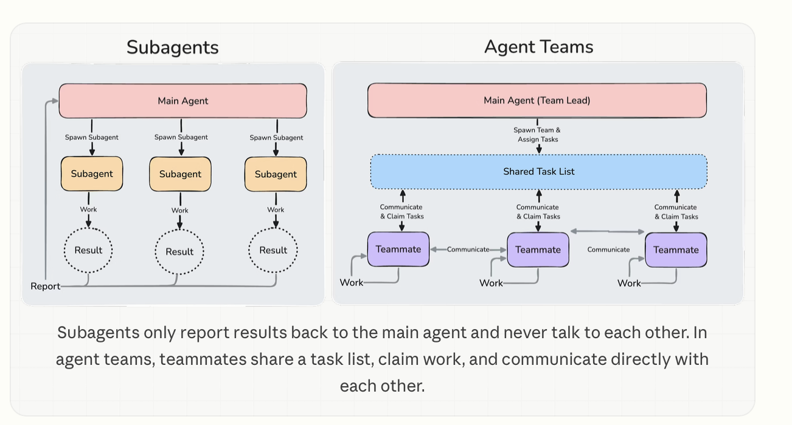
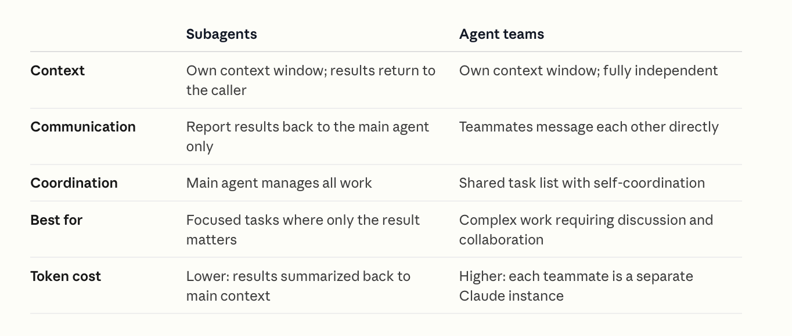

This is an experimental and beta feature in Claude Code as of early 2026. The idea is that there is a Main Agent (**Team Lead**) that can spawn many **Teammate** agents, and all the agents can communicate with each other. This is unlike the usual subagents where the subagent can only report a result back to the Main Agent.

[Documentation](https://code.claude.com/docs/en/agent-teams)

	



To enable Agent Teams, **CLAUDE_CODE_EXPERIMENTAL_AGENT_TEAMS** env variable has to be set to 1 or the change made in settings.json.

```
{
  "env": {
    "CLAUDE_CODE_EXPERIMENTAL_AGENT_TEAMS": "1"
  }
}
```

Note though that they are very context-intensive.