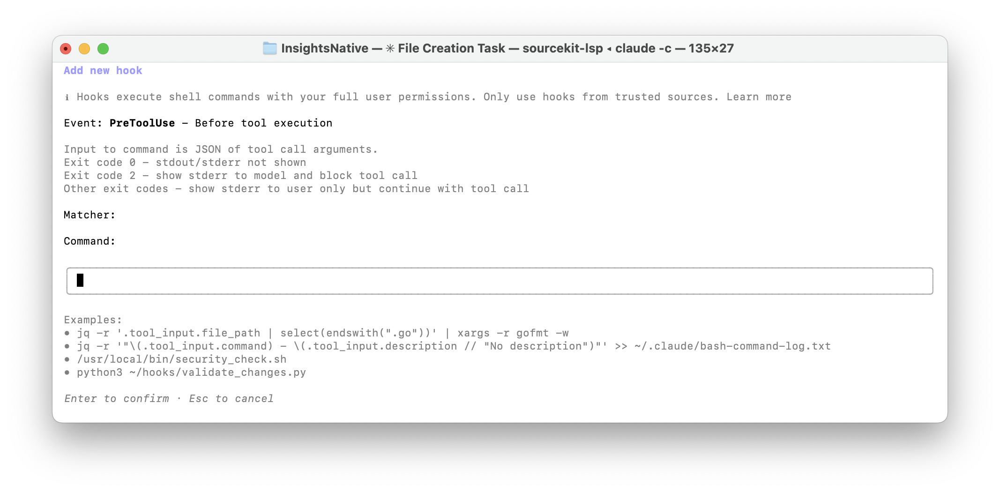
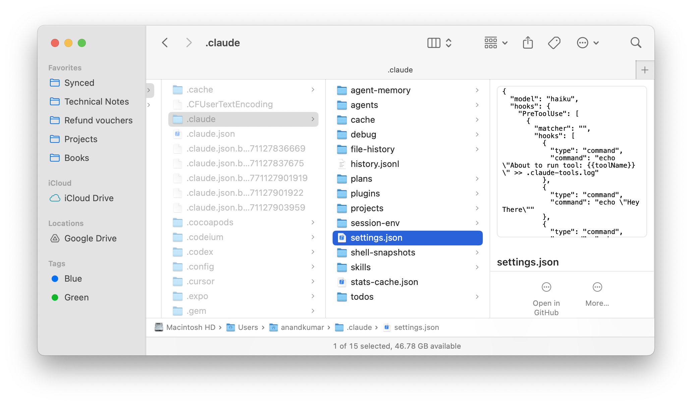
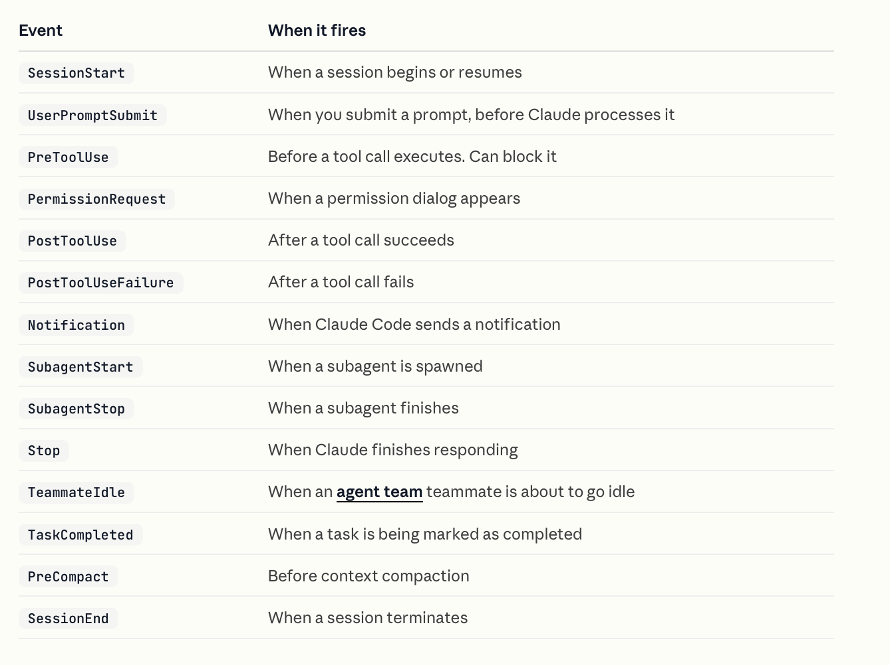

Plainly put, **hooks** are user defined shell commands or prompts that run automatically when certain events in Claude Code lifecycle happen.

[Documentation](https://code.claude.com/docs/en/hooks-guide), [Reference](https://code.claude.com/docs/en/hooks)

##### How to create a hook using /hooks

###### Step 1 - Do `/hooks` and select the type of hook

There are many different types.

```
 ❯ 1.  PreToolUse - Before tool execution
   2.  PostToolUse - After tool execution
   3.  PostToolUseFailure - After tool execution fails                                                      
   4.  Notification - When notifications are sent                          
   5.  UserPromptSubmit - When the user submits a prompt
   6.  SessionStart - When a new session is started                          
   7.  Stop - Right before Claude concludes its response                          
   8.  SubagentStart - When a subagent (Task tool call) is started                          
   9.  SubagentStop - Right before a subagent (Task tool call) concludes its response
   10. PreCompact - Before conversation compaction    
   11. SessionEnd - When a session is ending                                                   
   12. PermissionRequest - When a permission dialog is displayed                          
   13. Setup - Repo setup hooks for init and maintenance
   14. TeammateIdle - When a teammate is about to go idle                           
   15. TaskCompleted - When a task is being marked as completed
   16. Disable all hooks                      
```

###### Step 2 - Configure the matcher,  i.e. in what conditions to activate the hook

'Match all' implies no further filters are needed to constraint when to activate the hook

```
 ❯ 1. + Add new matcher…            
   2. + Match all (no filter)                                                        
   3. [User]  
```

###### Step 3 - Add the command or prompt

It will first show all the existing hooks for the filters selected so far, select 'Add new hook'. If you select an existing hook here, then you can delete that hook from here.

```
 ❯ 1. + Add new hook…                                                                                       
   2. echo "About to run tool: {{toolName}}" >> .claude-tools.log  User Settings     
   3. echo "Hey There"    
```

And then add the command.



###### Step 4 - Select storage/scope

```
 Where should this hook be saved?

 ❯ 1. Project settings (local)  Saved in .claude/settings.local.json
   2. Project settings          Checked in at .claude/settings.json
   3. User settings             Saved in at ~/.claude/settings.json
```

And that's it, it gets created and saved at the selected location/scope. 

It is a tad confusing as no clear confirmation prompt will be shown, just that all the hooks get shown again and this new hook is there appended to the previous list.

```
 ❯ 1. + Add new hook…                                               
   2. echo "About to run tool: {{toolName}}" >> .claude-tools.log  User Settings
   3. echo "Hey There"                                             User Settings
   4. echo "hey"           
```

##### Hook locations and scopes

User level hooks are saved in ~/.claude/settings.json. In fact, you can also just edit that file to modify/delete the existing hooks. In fact directly editing these files is usually the better way if you make sure to get the syntax right.



```
  "hooks": {
    "PreToolUse": [
      {
        "matcher": "",
        "hooks": [
          {
            "type": "command",
            "command": "echo \"About to run tool: {{toolName}}\" >> .claude-tools.log"
          },
          {
            "type": "command",
            "command": "echo \"Hey There\""
          },
          {
            "type": "command",
            "command": "echo \"hey\""
          }
        ]
      }
    ]
  },
```


##### Hookable Events



Each hook has a type that determines how it runs. Most hooks use `"type": "command"`, which runs a shell command. Two other options use a Claude model to make decisions: `"type": "prompt"` for single-turn evaluation and `"type": "agent"` for multi-turn verification with tool access.

##### Command-based hooks

You can also create a shell script and put that in the command. But make sure to make it an executable with 'chmod +x'.

```
"hooks": [
  {
    "type": "command",
    "command": "echo \"Hey There\""
  },
]
```


##### Prompt-based hooks 

**Prompt-based hooks** are hooks that are non-deterministic and require Claude to run its model and decide whether the intended action should happen or not. These do not run a shell command, etc. ([Reference](https://code.claude.com/docs/en/hooks#prompt-based-hooks))

```
"hooks": [
          {
            "type": "prompt",
            "prompt": "Check if all tasks are complete. If not, respond with {\"ok\": false, \"reason\": \"what remains to be done\"}."
          }
        ]
```

##### Agent-based hooks

**Agent-based hooks** are hooks where verification requires inspecting files or running commands. ([Reference](https://code.claude.com/docs/en/hooks#agent-based-hooks))

```
"hooks": [
          {
            "type": "agent",
            "prompt": "Verify that all unit tests pass. Run the test suite and check the results. $ARGUMENTS",
            "timeout": 120
          }
        ]
```


