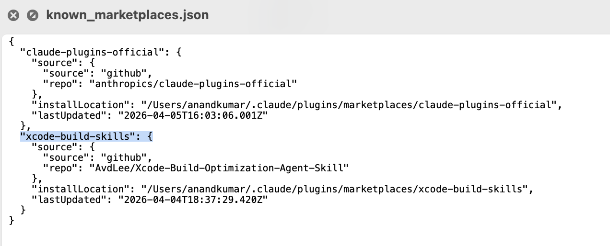
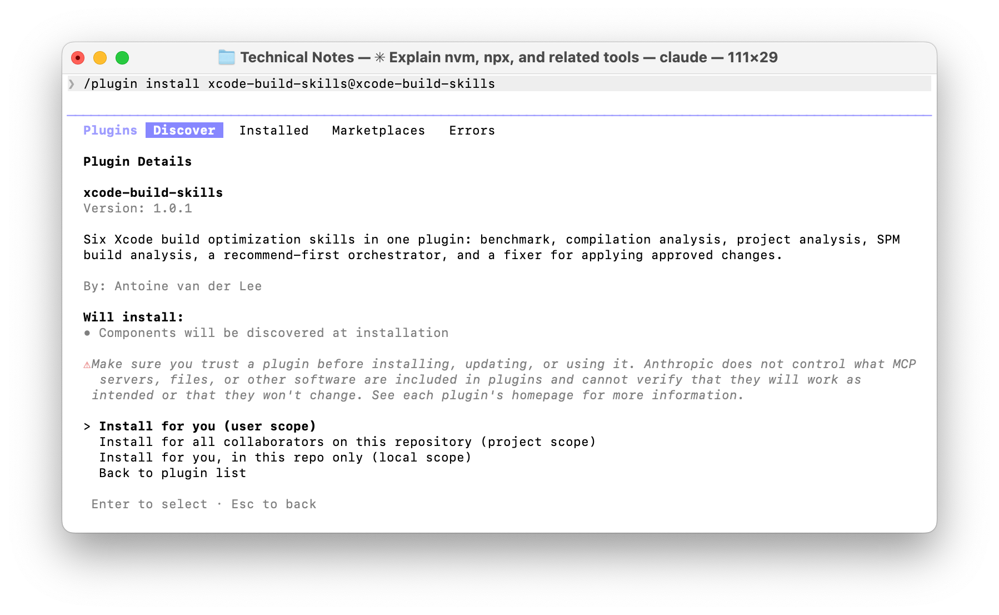
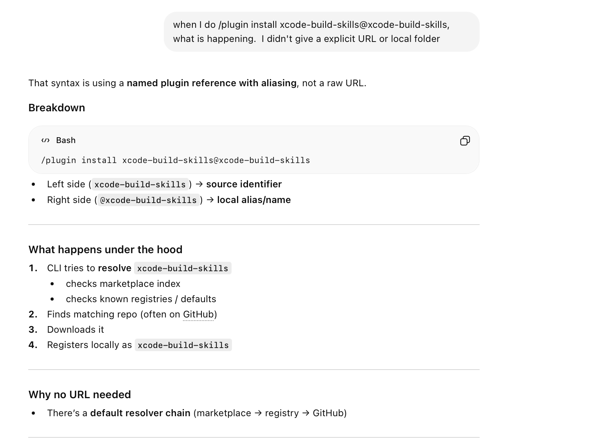
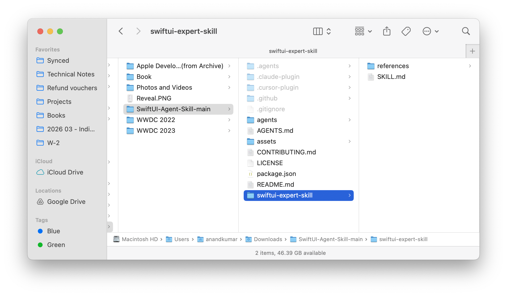
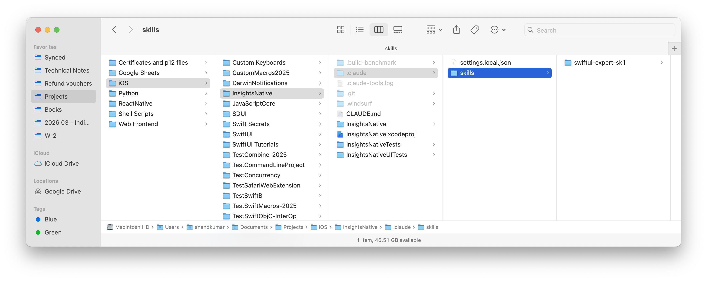

[toc]

##### What are they

**Plugins** are likely just a way to assmble custom skills, agents, hooks, MCP servers, and LSP servers into one bundle/package. ([Documentation](https://code.claude.com/docs/en/plugins))

And they are then distributed through the **marketplace**. ([Documentation](https://code.claude.com/docs/en/plugin-marketplaces))

> All the below is sourced from the examples in readme of an [Antoine v.d. Lee plugin](https://github.com/AvdLee/Xcode-Build-Optimization-Agent-Skill/blob/main/README.md#installation-options) repo.

##### Installing using /plugin

**/plugin marketplace add** - Adds a plugin to local registry, i.e. `/Users/anandkumar/.claude/plugins/known_marketplaces.json`. The way it works is that it automatically looks for the passed argument in [skills.sh](https://skills.sh) website, and if it doesn't find there it looks for that in GH assuming the format is 'username/reponame'. So it could just work if you simply created a GH repo and put a properly structured plugin in it.

```
/plugin marketplace add AvdLee/Xcode-Build-Optimization-Agent-Skill
```



**/plugin install** - This supposedly installs the plugin (prompts you through the required steps), i.e. makes entry in ``/Users/anandkumar/.claude/plugins/installed_plugins.json`, which then makes it skills, etc. available in the a given Claude Code session.

```
/plugin install xcode-build-skills@xcode-build-skills
```



> Need to check more, looks like '/plugin install' can be used even if its not been preceded by '/plugin marketplace add'. It checks the registry anyway. ([ChatGPT link](https://chatgpt.com/g/g-p-698d2759efe081918edd9bc11bd1158a-claude-code/c/69d13af2-79bc-83a6-a08b-046919a605ab)) <br>


##### Installing through skills.sh

Its also possible to use skills.sh website's node package to install skills. For example,

```
npx skills add https://github.com/avdlee/xcode-build-optimization-agent-skill
```

or to add a single skill from a given plugin

```
npx skills add https://github.com/avdlee/xcode-build-optimization-agent-skill --skill xcode-project-analyzer
```

##### Manually installation

That is as simple as getting hold of the skill, etc. from a GH repo and placing it physically in your repo's (or desired) folder. That's it.

| 1. Copied a skill folder from a cloned repo                  | 2. And pasted in a project's skills directory                |
| ------------------------------------------------------------ | ------------------------------------------------------------ |
|  |  |

##### Installing through pi 

Yes, the same thing can also be done through other package known as **pi**.

```
pi install https://github.com/AvdLee/Xcode-Build-Optimization-Agent-Skill
```

> A little unclear as the hyperlink (https://www.npmjs.com/package/@mariozechner/pi) is broken now.