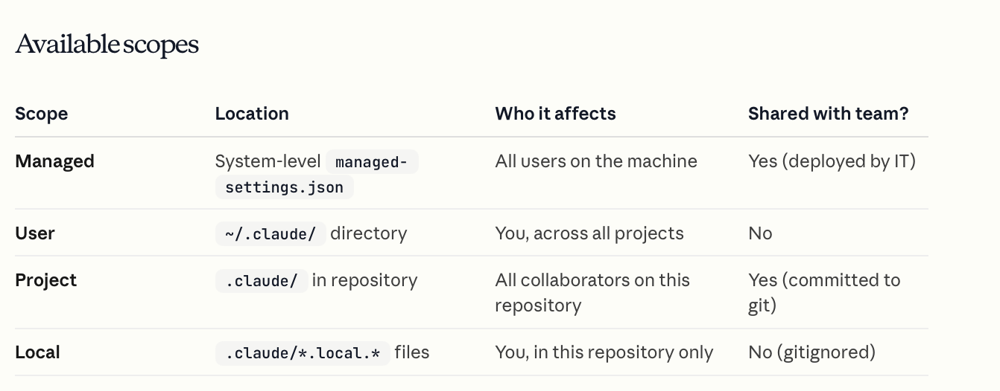
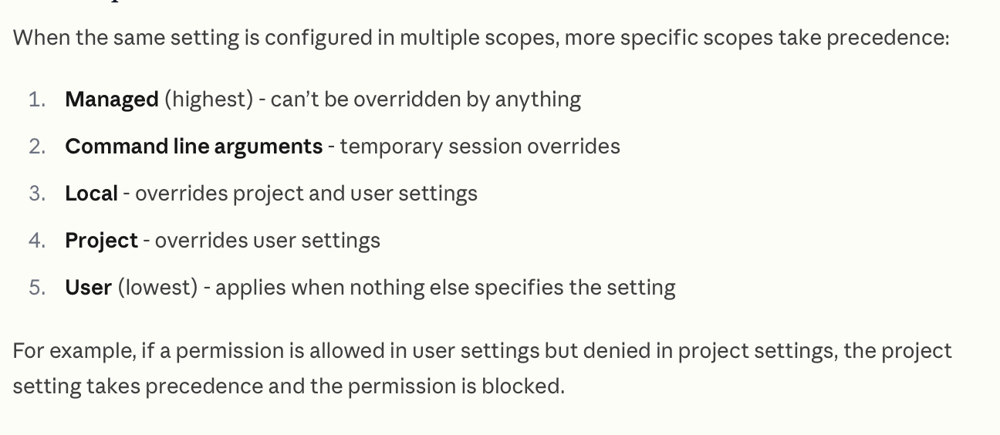
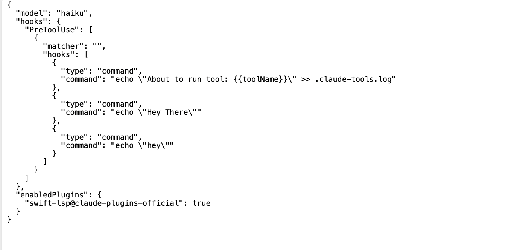
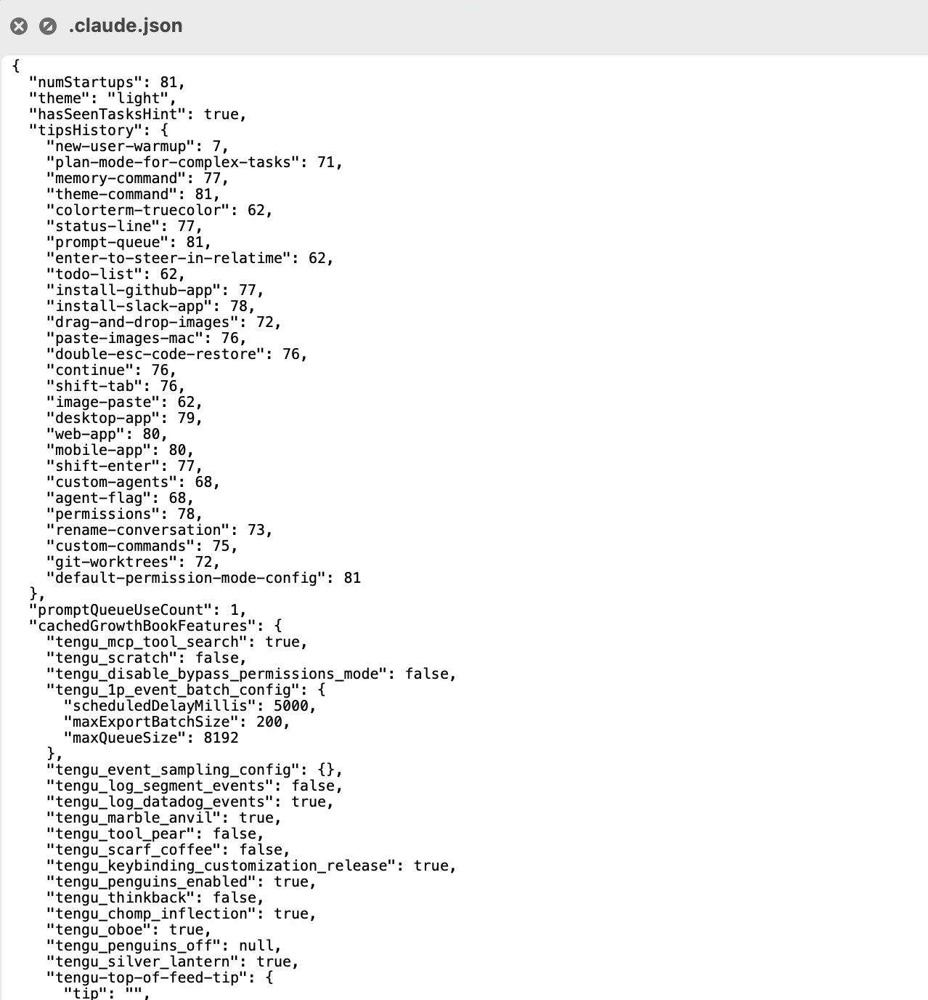
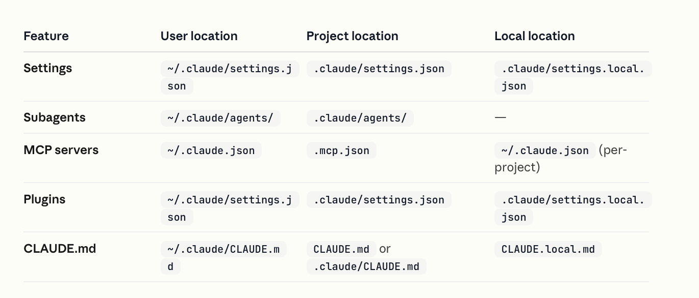
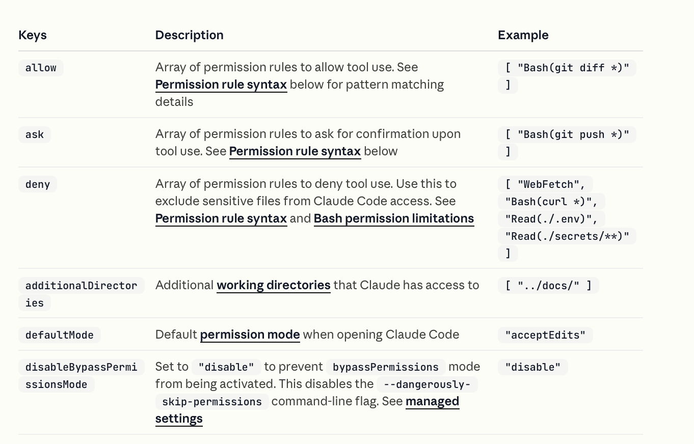
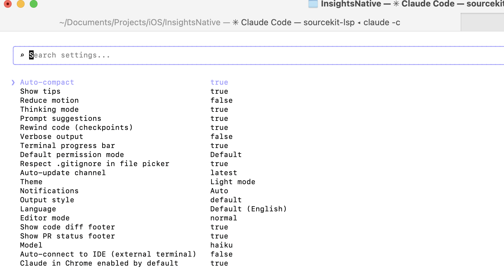

[toc]

[Documentation](https://code.claude.com/docs/en/settings)

##### Configuration Scopes

Various settings that are tweakable, can be changed at various levels - System wide for all users using it (enterprise owned), system wide for current user (user-managed), Project specific (user-managed but version controlled). Just like CLAUDE.md.

Note how there is a special `managed-settings.json` file too for Enterprise level settings, it is known as **managed settings**.



##### Scope precedence order



##### settings.json

There is a **settings.json** file that controls several things. Just like CLAUDE.md, it too is available in various scopes (managed, local, project, etc.).

For example, here is my current local settings.json file.




#####  ~/.claude.json

There also happens to be a special **~/.claude.json** file that controls more mundane and less needed things like theme, notification settings, editor mode), OAuth session, MCP server configurations for user and local scopes, per-project state (allowed tools, trust settings), and various caches.

For example, here is my current ~/.claude.json file.



##### Settings file locations for Agents, MCP, Plugins, CLAUDE.md etc.

([Documentation](https://code.claude.com/docs/en/settings#what-uses-scopes))



##### Permission settings

There is a specific key called **permissions** in settings.json, it controls things like what Claude tools have what access, what working directories Claude has access to, etc. ([documentation](https://code.claude.com/docs/en/settings#permission-settings))



> There is lot more at work here, the reference has the full deal.

**/config**

The **/config** slash command lets you control some of the things for the current session only and not persistent system level config things.



##### Environment variables

Several things happen through plain vanilla shell environment variables. You need to set them before you start your claude session. ([Reference](https://code.claude.com/docs/en/settings#environment-variables))

```
export CLAUDE_CODE_DISABLE_AUTO_MEMORY=1

claude
!echo $CLAUDE_CODE_DISABLE_AUTO_MEMORY // prints 1
.... use claude
/exit

unset CLAUDE_CODE_DISABLE_AUTO_MEMORY
!echo $CLAUDE_CODE_DISABLE_AUTO_MEMORY // prints nothing
```

