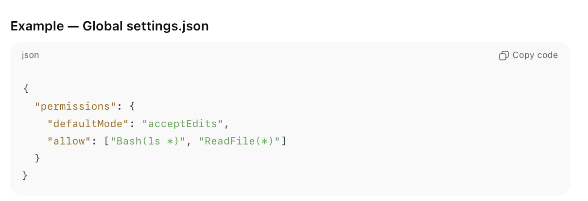
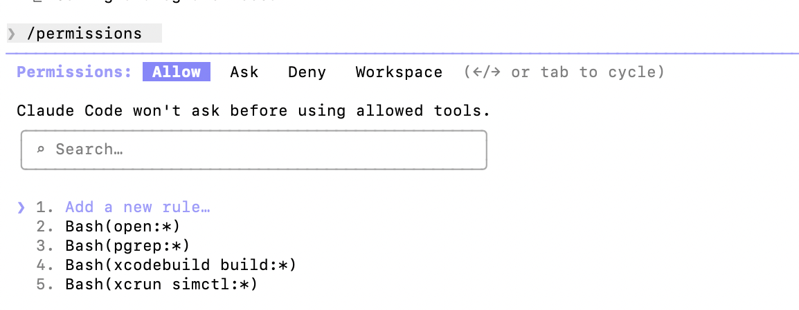
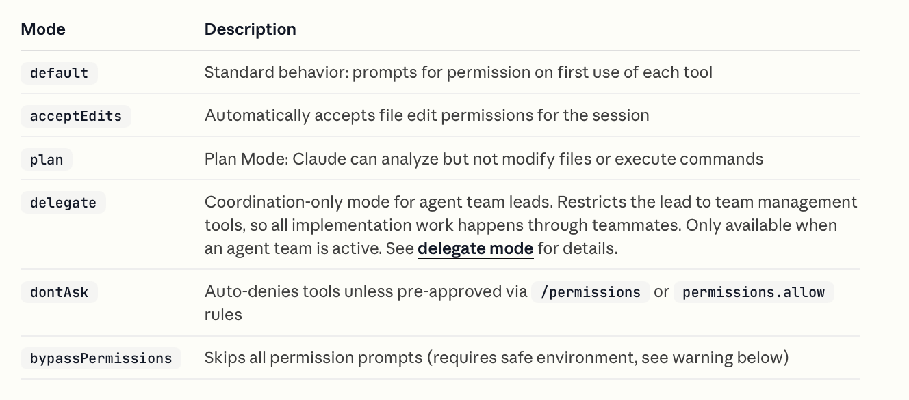
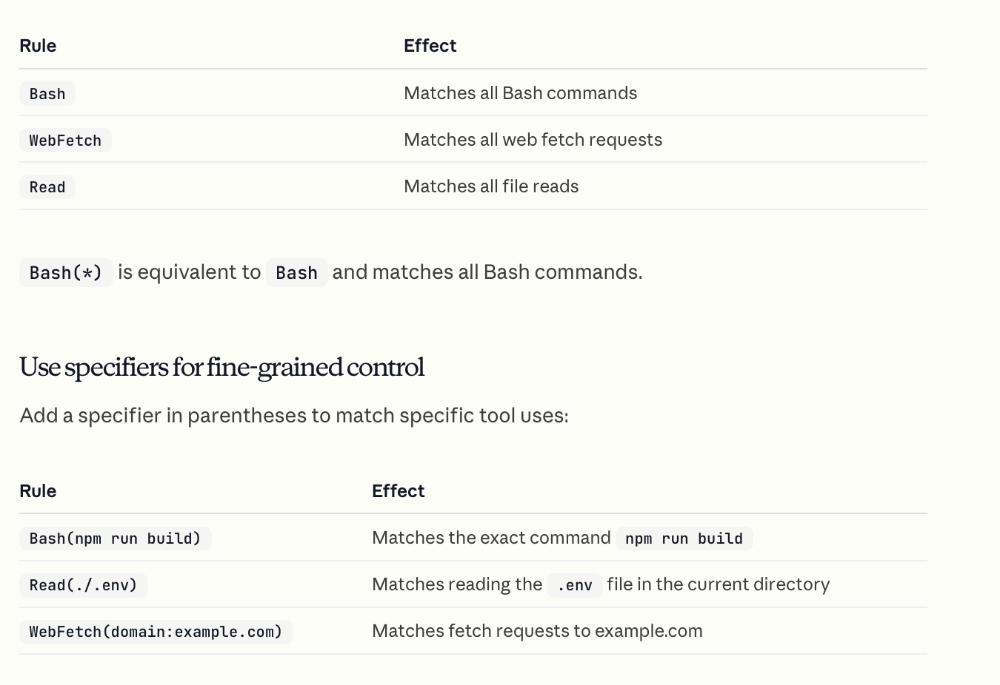
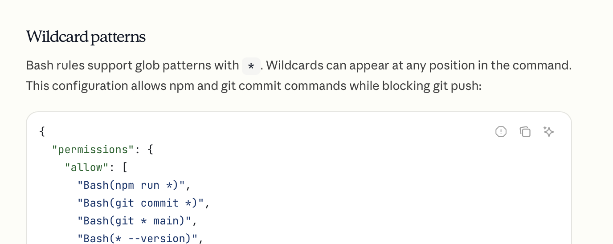
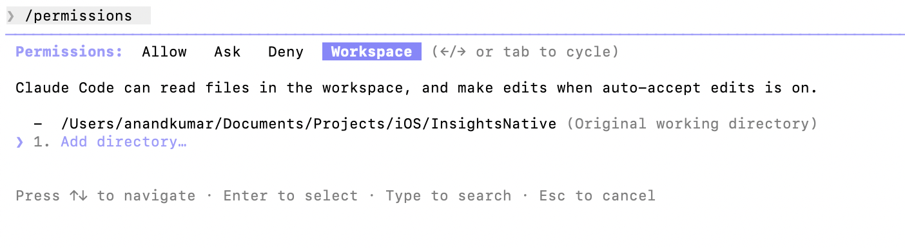

[toc]

How much access various tools have get configured through the **permissions** key in various settings.json files. And these can probably also be edited using **/permissions** key.

And then there are sub-keys in it.

##### defaultMode (File edit access)

**defaultMode** decide whether files can be edited ot not and has these possible values. ([reference](https://code.claude.com/docs/en/permissions#permission-modes))

##### allow/ask/deny

Whether a tool can be used or not, the basic keys ([reference](https://code.claude.com/docs/en/permissions#manage-permissions))

##### allow/ask/deny permission rule syntax

I think the allow/ask/deny keys can have values that say what hapens for various tools. And the syntax for those values is of this sort. ([reference](https://code.claude.com/docs/en/permissions#permission-rule-syntax))

##### Extend permissions with hooks

Hooks too can be used to further control permissions for a given tool. ([documentation](https://code.claude.com/docs/en/permissions#extend-permissions-with-hooks))

##### Working directories

This controls what directories a session can access. For a given session, it can be configured using **/permissions** or even **/add-dir** (the corresponding CLI option is **--add-dir**). 

For persistent configuration, changes should be made for **additionalDirectories** key to tye appropriate settings file.

([documentation](https://code.claude.com/docs/en/permissions#working-directories))