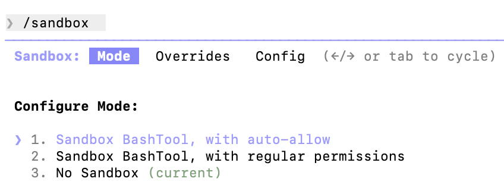
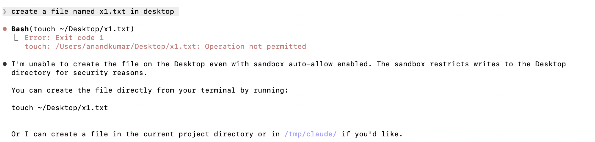
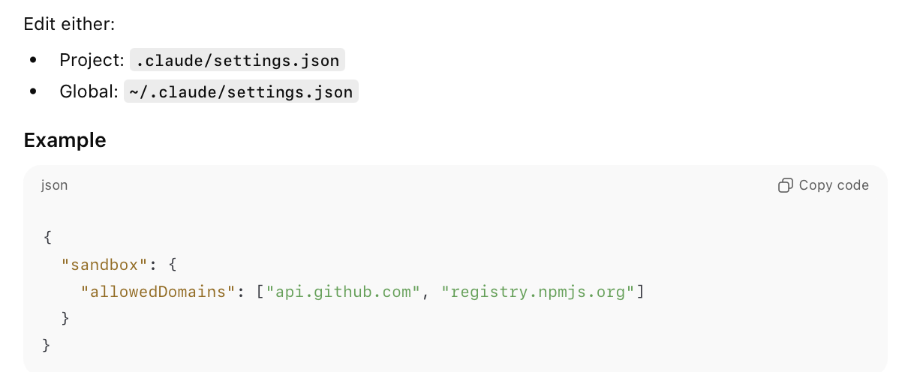

[toc]

[Documentation](https://code.claude.com/docs/en/sandboxing)

##### What is it

The basic idea is that by default Claude Code's Bash Tool is able to do things even outside the current working directory, this can change that. And actually more, even things like what web domains can be accessed.

> Note that 'Claude Code Permissions ' can apply to all Tools and not Just Bash Tool.

> Also,  if you enter **bash mode** with **!**, any of this does not apply as then you are basically running an independent shell session.

##### Filesystem Isolation

**Sandbox BashTool, with auto-allow** means that the bash tool will run only in current sandbox and without needing any permissions, but for any run outside working directory it will be denied.

**Sandbox BashTool, with regular permissions** means that the bash tool will run only in current sandbox and will seek  permissions everytime, but for any run outside working directory it will be denied.

And in **No Sandbox** the bash tool can even run outside the current sandbox.

##### Network Isolation

If sandbox is enabled, you can control what domains bash tool will be able to curl. They are specified in settings files.

