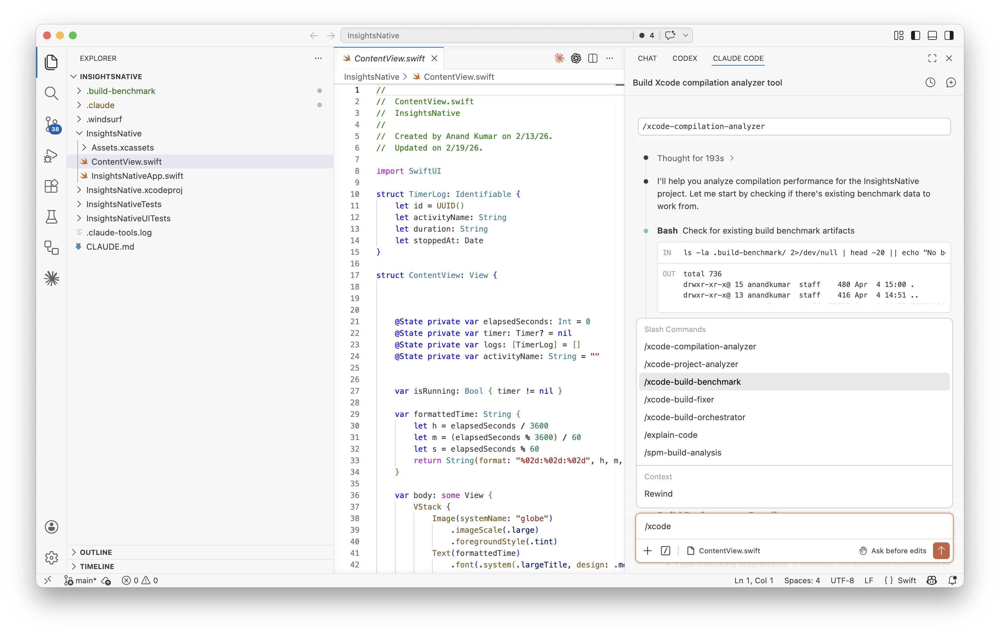
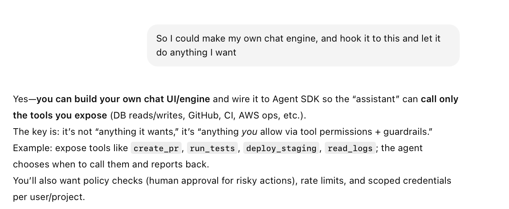
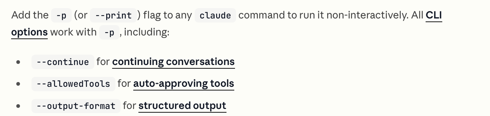
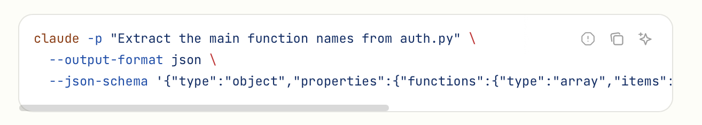
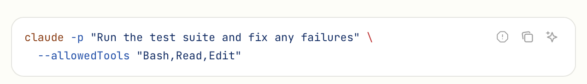
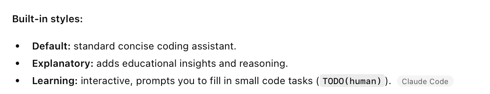
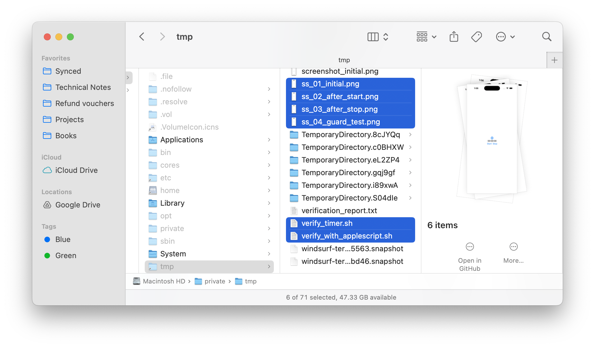
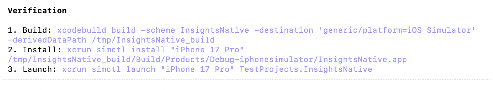

[toc]

##### Entry Points/Interfaces

Just like Codex, Claude Code too has similar interfaces (but not all of them).

1. Claude Code **CLI** (the primary interface)
2. Claude Code Visual Studio **extension**
3. **Claude Code Web** (similar to Codex Web, where you can connect to GH repos and make changes to them and run on virtual servers, in beta as of Apr 2026, [link](https://code.claude.com/docs/en/claude-code-on-the-web))

There is also something known as **Claude Console**, its basically just an onine playground to easily test Anhtropic APIs (like you would with Postman). [Link](https://platform.claude.com/dashboard). These APIs are things such as https://api.anthropic.com/v1/messages.

##### Visual Studio Code extension

Just like Codex extension. Once installed and enabled, it gets a tab of its own in right pane. You can trigger agents, etc. from here with the usual slash command syntax.

##### AgentSDK and CLI access

There are [Python](https://platform.claude.com/docs/en/agent-sdk/python) and [TS](https://platform.claude.com/docs/en/agent-sdk/typescript) packages that can let you communicate with Claude Code and let it do things. 

([Documentation](https://code.claude.com/docs/en/headless))

There is also CLI access for scripts and CICD, which is nothing but **claude -p** which basically lets you run any claude command non-interactively. 

##### Output Style

**/output-style** lets you configure its personality and output i.e. default, explanatory, or learning. 

[Documentation](https://code.claude.com/docs/en/output-styles)

You can also create custom styles (md files) and put them at user level (~/.claude/output-styles) or project level (.claude/output-styles).

##### How Claude builds and tests iOS apps

It essentially uses **xcodebuild** to perform builds, then **xcrun simctl** to install and launch the app in sumulator, and take screenshots, **xdotool** ([link](https://github.com/jordansissel/xdotool)) to perform user gestures on the simulator, take more screenshots and save them, and finally writes a script to verify the screenshots. It places all of these screenshots and the script in `tmp` directory.

> The sample scripts are there in 'Verification Samples' folder.

Given that this is error-prone, I edited the Plan to just build the code and install the app. And then it gave me these as verification steps.

