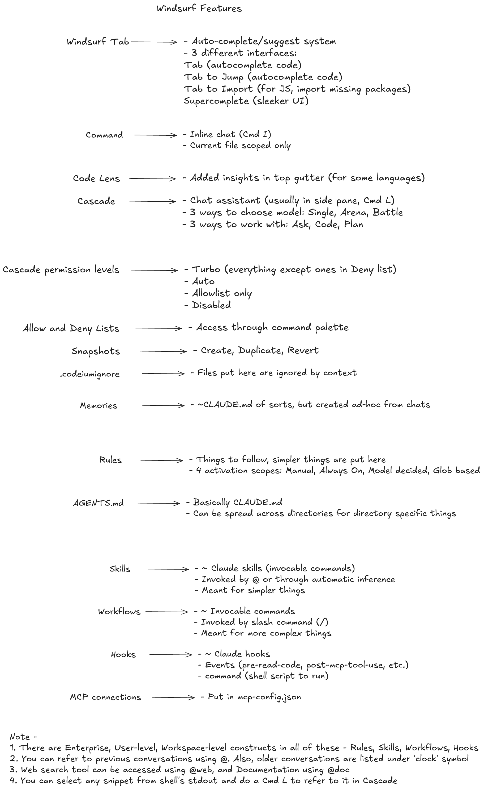
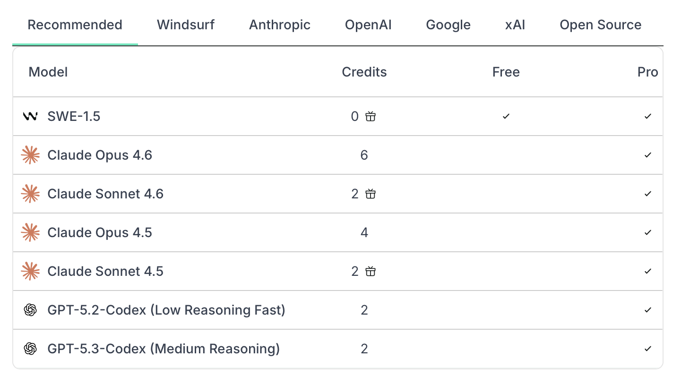
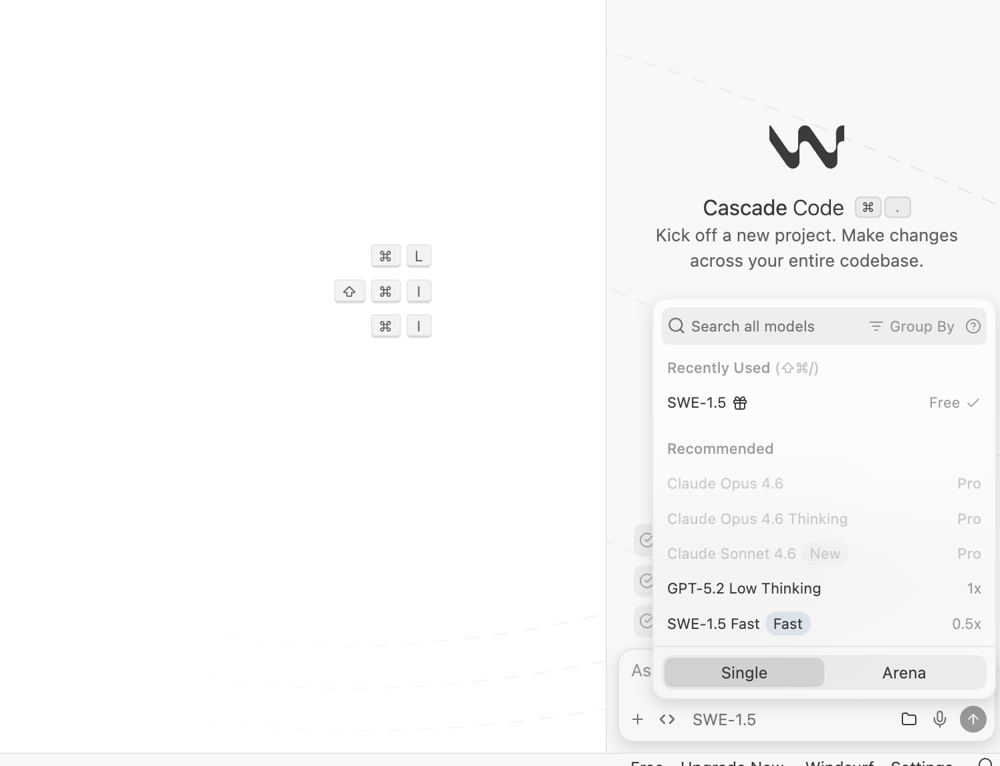

[toc]

##### Gist

##### Models

It supports several different models - **SWE** (Windsurf's own model), GPT (OpenAI), Claude (Anthropic), etc. It provides some extent of usage of these models and also let's you use your own keys from those companies to use as appropriate.

The model to be used can be changed from Cascade (its chat) panel.

##### Tools

Windsurf too has some tools - things such as Search, Analyze, Web Search, MCP, terminal, etc. Cascade can make up to 20 tool calls per prompt. Cascade can detect which packages and tools that you’re using, which ones need to be installed, and even install them for you.
