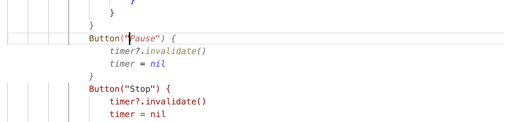
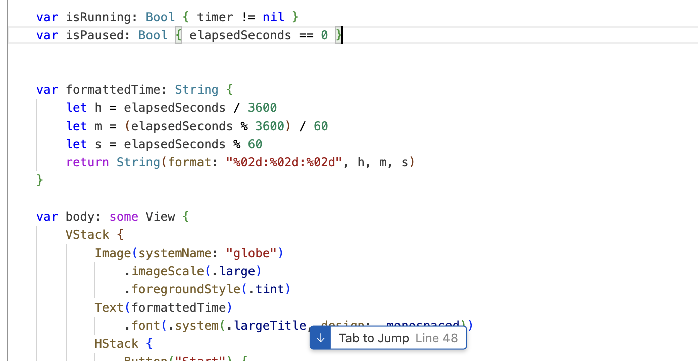
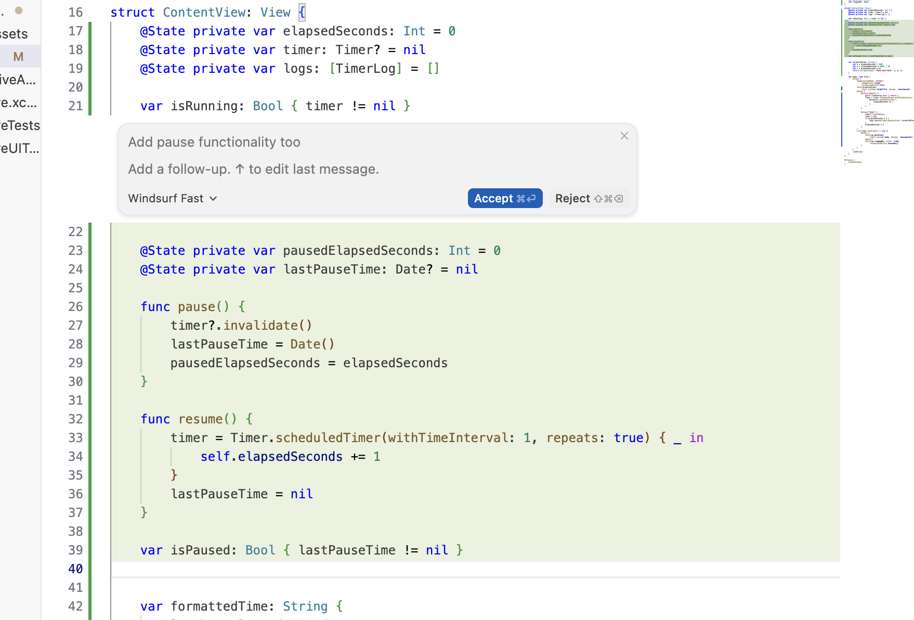
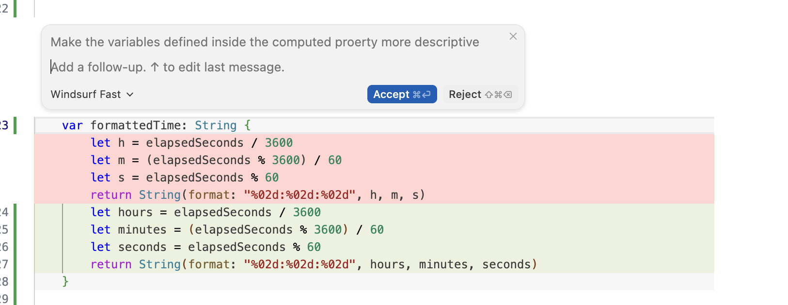
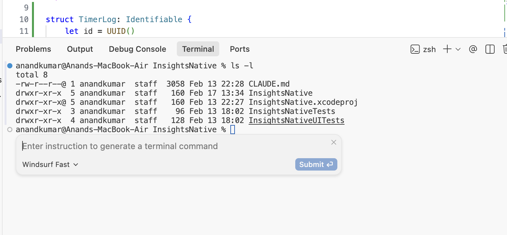
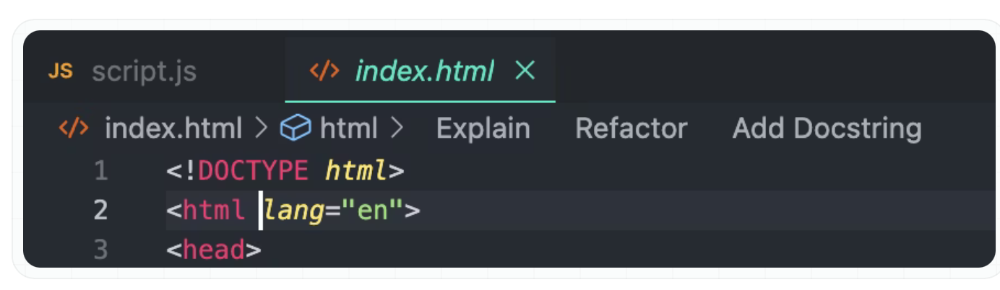
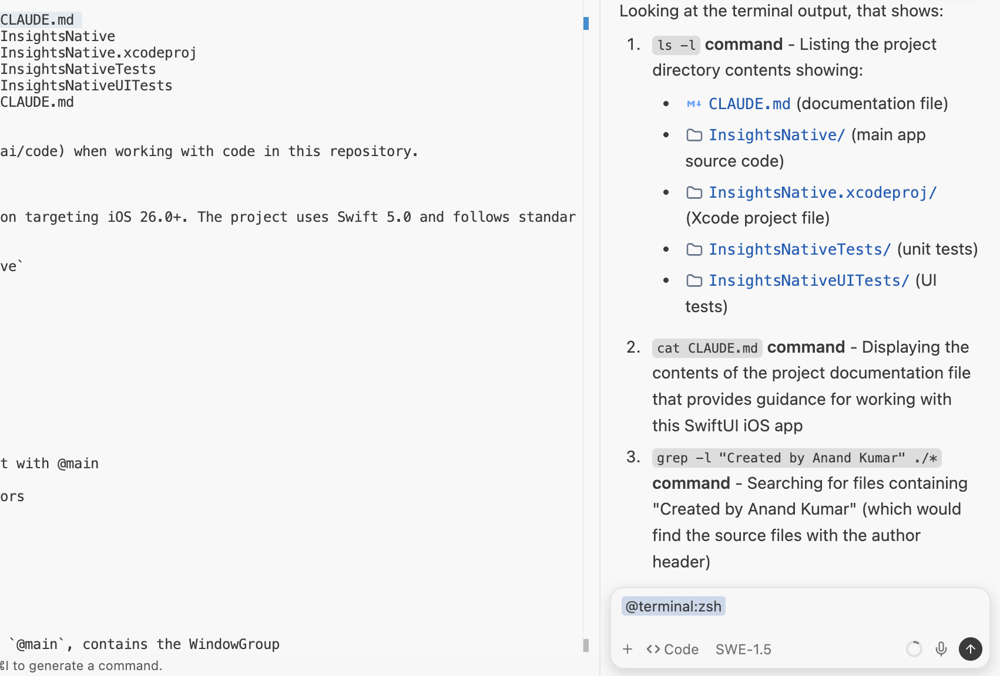
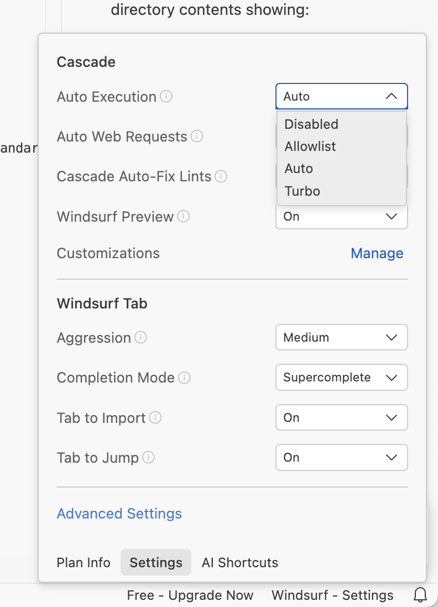
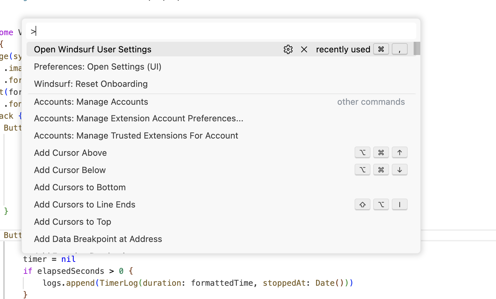
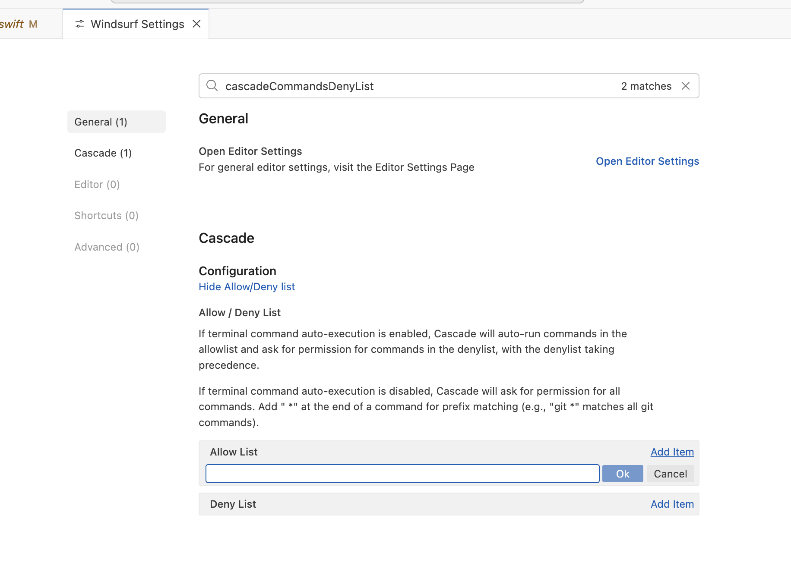

[toc]

##### Windsurf Tab

The in-editor autocomplete system is what is known as **Windsurf Tab**.

Accept suggestions - Tab  Reject suggestions - Cancel  Accept suggestions word by word - Cmd + Right Arrow

###### Tab to Jump

That is when Windsurf simply anticipates the next cursor position you may be interested in and prompts you to jump to it.

###### Tab to Import

Probably more of a JS project kind of thing, where if you use some symbol from an unimported package then there is a 'Tab to Import' prompt that comes up which automatically imports the package. 

###### Supercomplete and Autocomplete

It is in fact offered in two flavors - Supercomplete, and Autocomplete. The former probably has some sleeker UI.   [Documentation](https://docs.windsurf.com/tab/overview#settings) 

##### Command

Inline code generation on demand is what is known as **Command**, it can be invoked by **Cmd I**. 

Note that it is meant for file-scoped changes only, do not expect it to somehow make changes across multiple files.

You can also select a code section and then invoked Command to edit it.

Note that you can also change the Model to be used in Command.

It is also possible to use Command like in line chat in the **Integrated Terminal** in Windsurf. It generates a proper shell command.

##### Code Lenses

Basically, some added prompts that come for things like explain, document, refactor in the top gutter. Its probably only supported for some languages (Swift not there) or is not there in the free plan.

##### Terminal

You can select any section in the Terminal, and do a **Cmd L** there to send it to Cascade (the chat window i.e.) and chat about it. It will show up in Cascade as something like `@terminal:zsh`.

##### Cascade commands permissions

Cascade can run shell commands itself, here are the possible permissions. ([Documentation](https://docs.windsurf.com/windsurf/terminal#auto-executed-cascade-commands))

Turbo - All commands run immediately, except ones in deny list  Auto - Cascase uses its own judgement on if to run a command without permission  Allowlist only - Only the ones in allowlist  Disabled - Require approval for everything

This can be configured from Windsurf Settings.

###### Allowlist and Deny list

These can be provided using 'Command Palette > Open Windsurf User Settings >**cascadeCommandsAllowList**, **cascadeCommandsDenyList**'

For Teams and Enterprise users, administrators can set a maximum allowed auto-execution level for their organization. 

> Windsurf now uses a dedicated zsh terminal inside it which is distinct from your system's default shell/terminal.