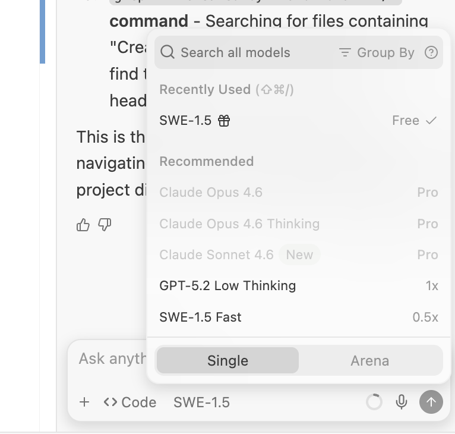
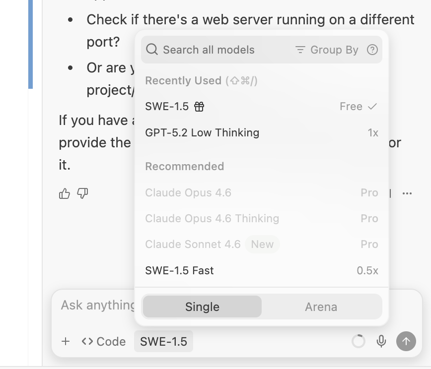
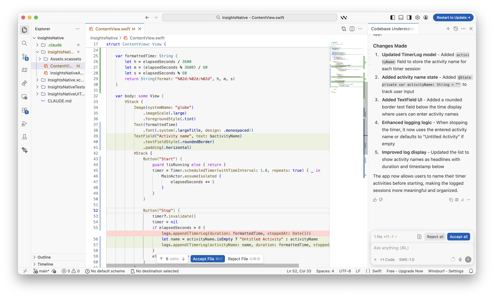
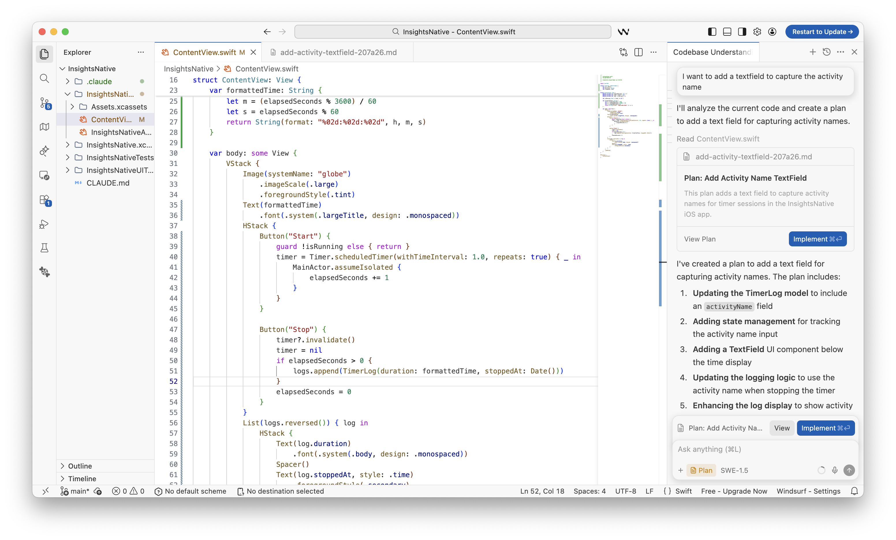
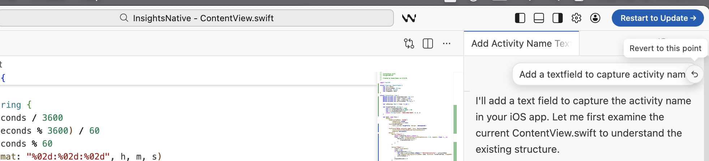
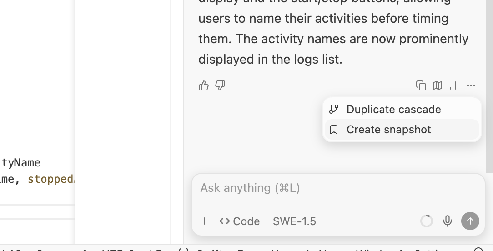
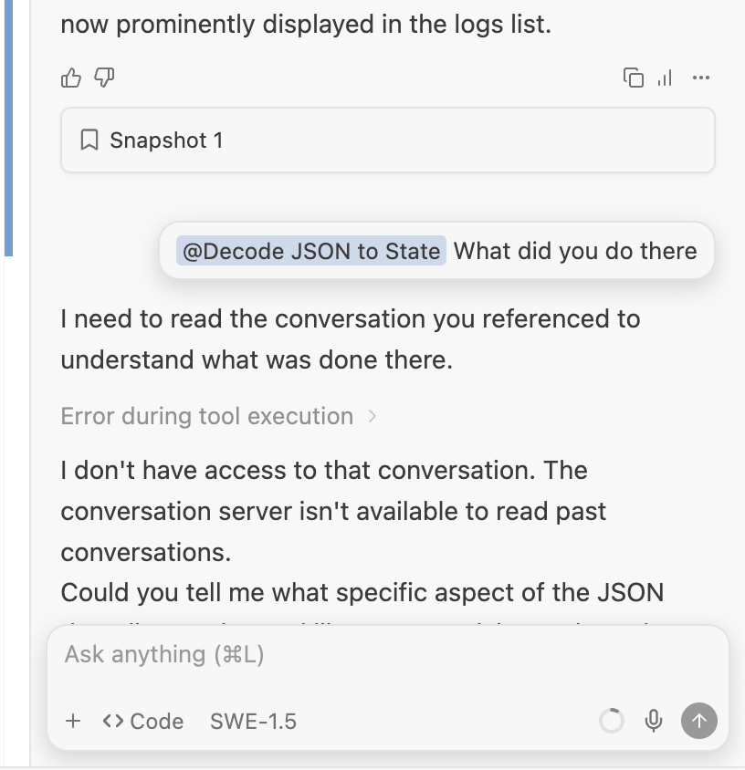
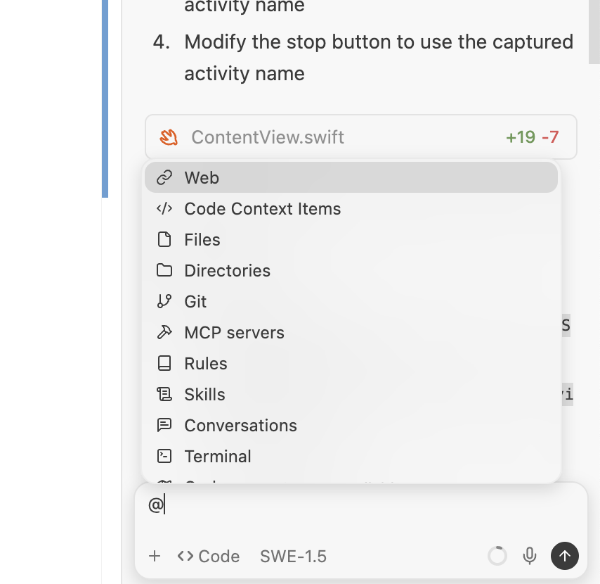
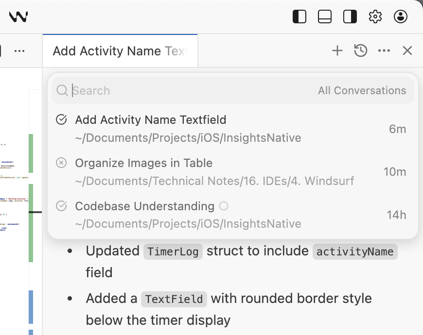

[toc]

**What is it**

**Cascade** is Windsurf's AI assistant and has chat/code modes. It can be accessed using **Cmd L**.

 Meesages can be queued to Windsurf even while the previous message is being still processed. Also, it can make up to 20 tool calls per prompt. It can detect which packages and tools that you’re using, which ones need to be installed, and install them for you. 

##### Changing the model, and Arena Mode

There are different models available to chose from.

Also there is this new thing called **Arena mode** to compare outcomes from two different models side-by-side as opposed to the traditional **Single mode**. ([link](https://docs.windsurf.com/windsurf/cascade/arena)) They also have something called **Battle mode** which auto-suggests the models to compare.

Its Activated through the Arena mode in the model picker.

##### 3 Modes - Ask, Code, Plan

[Documentation](https://docs.windsurf.com/windsurf/cascade/modes)

**Code mode** - The default mode. Code suggestions are actually given in the Editor. Can even install dependencies etc. if needed.

**Plan mode** - A full plan is given in the chat window with an eventual Implement button. During implementation it automatically switches to Code model. The plan markdowns are saved in `~/.windsurf/plans` are also available in @mentions menu which can. then be used to easily resume or even start afresh an implementation.

**Ask mode** - Your just chat with Cascade, it does not give any suggestion directly in the Editor but could give still in the chat window itself.

| Code Mode | Plan Mode |
|---|---|
|  |  |

​	

##### Reverting changes

Hover over the prompt in Code mode. This too internally uses checkpoints.

##### Naming snapshots

A named snapshot can be created. The snapshot then shows up right at that scroll position in Cascade, but it doesn't look like there is an easy way to see a list of all named snapshots together. You'd have to scroll to that snapshot in Cascase chat and then do a revert if you want to. 

| Create Snapshot                                              | Access Snapshot                                              |
| ------------------------------------------------------------ | ------------------------------------------------------------ |
|  |  |

##### Codeiumignore

If you’d like Cascade to ignore files, you can add your files to `.codeiumignore` at the root of your workspace. This will prevent Cascade from having them in its context, let alone editing them.

For enterprise customers managing multiple repositories, you can enforce ignore rules across all repositories by placing a global `.codeiumignore` file in the `~/.codeium/ folder`. 

##### Referring previous Conversations

It can be done with `@`.

##### Simultaneous Cascades

Users can have multiple Cascades running simultaneously. You can navigate between them using the 'Clock' dropdown menu in the top left of the Cascade panel.

##### Misc.

While it ususally infers the need itself, you can force internet or documentatioin search through **@web** or **@doc**. It grabs and analyzes real time content from searching web and documentation. **@docs** can be used to query over a list of documents.