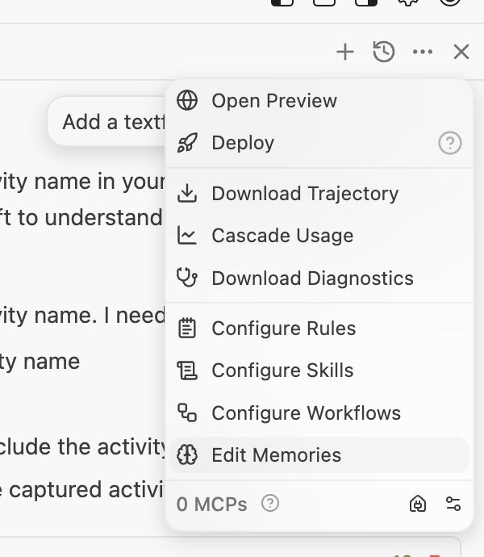
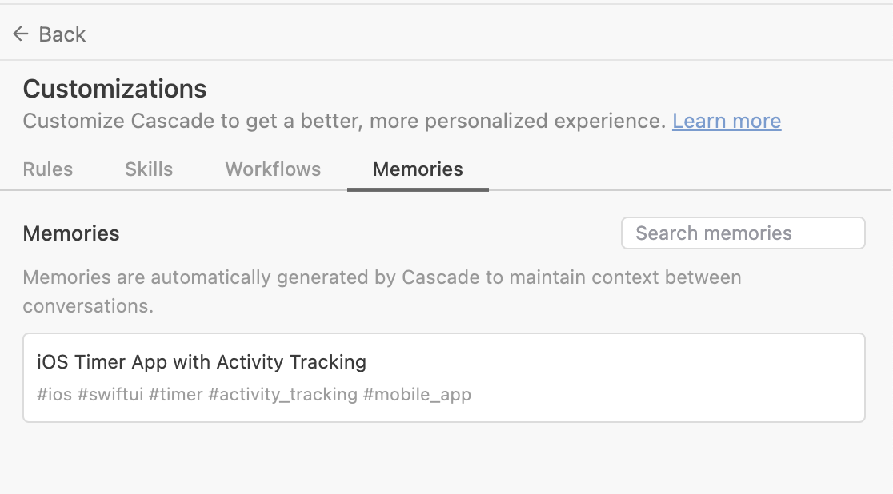
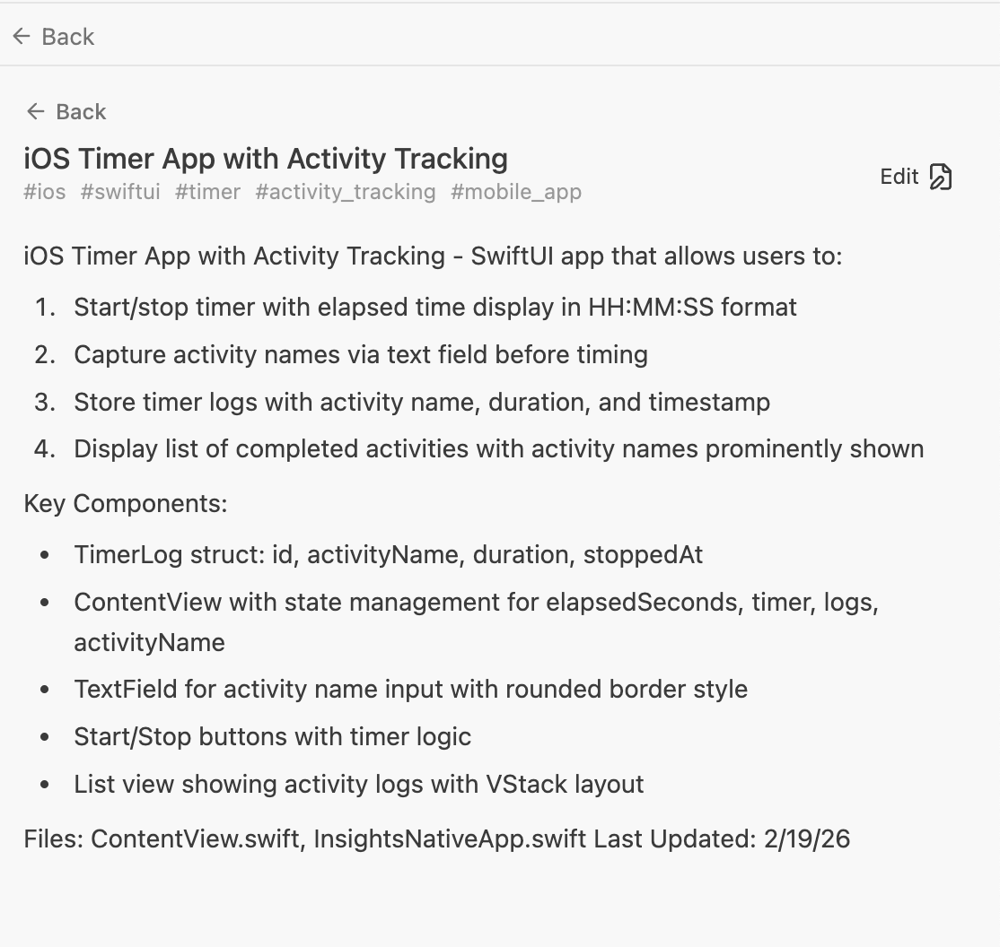
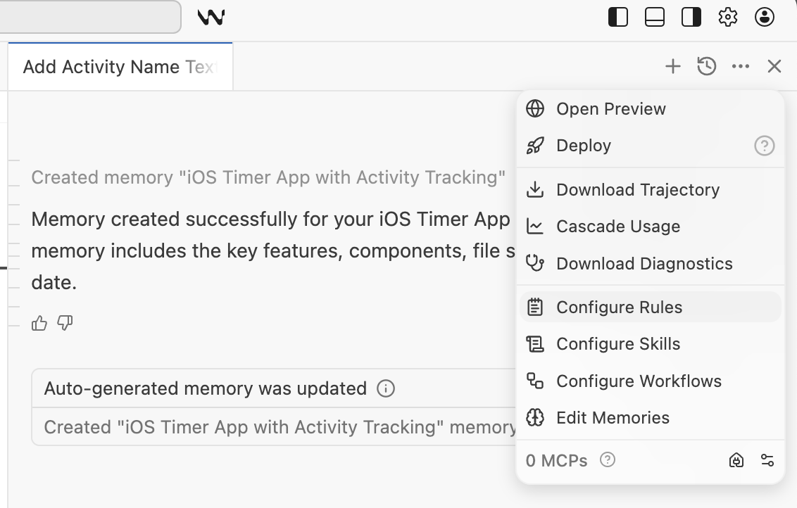
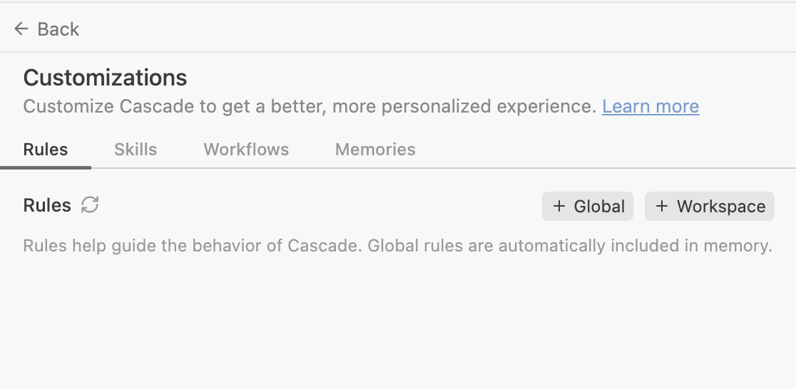
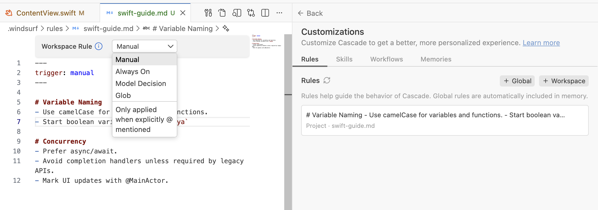
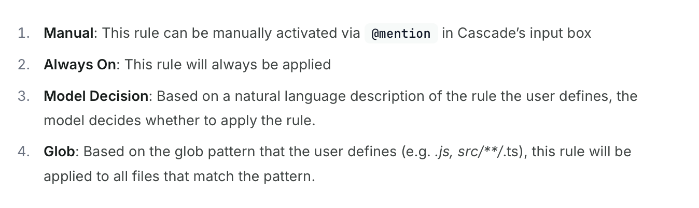

##### Memories

**Memories** is what persists context across conversations (i.e. sessions). During conversation, Cascade automatically generates and store memories if it believes something is useful to remember. You can also tell it to create one for the current state by just saying so in Cascade. 

| Actions                                                      | Memories                                                     |
| ------------------------------------------------------------ | ------------------------------------------------------------ |
|  |  |

Essentially its some text, and you can edit it too.

Note that Memory is just some general information, and not an exact comprehensive snapshot of a given state. Memories help Windsurf built some context, that's it.

##### Rules

**Rules** are explicitly defined rules for Cascade to follow. 

There are two rules files - **global_rules.md** (applied across all projects/workspaces) and **.windsurf/rules** (applies to a given project/workspace). For the project level rules, they can also be nested in any child directories anywhere in the workspace. They don't have to be in the root.

Rules too are accessible from the same 'Cascade Chat Panel > Actions > Configure Rules'.

| Actions                                                      | Rules                                                        |
| ------------------------------------------------------------ | ------------------------------------------------------------ |
|  |  |

Rules files are limited to 12000 characters each.

##### Rule Activation Modes

There are 4 options on when to activate a rule. For manual trigger specify the rule name in chat window using `@` symbol. In below screenshot the rule's name is 'swift-guide.md' (you specicy it while creating).

##### Enterprise level Rules

Enterprise organizations can deploy system-level rules at `/Library/Application Support/Windsurf/rules/*.md` that apply globally across all workspaces and cannot be modified.