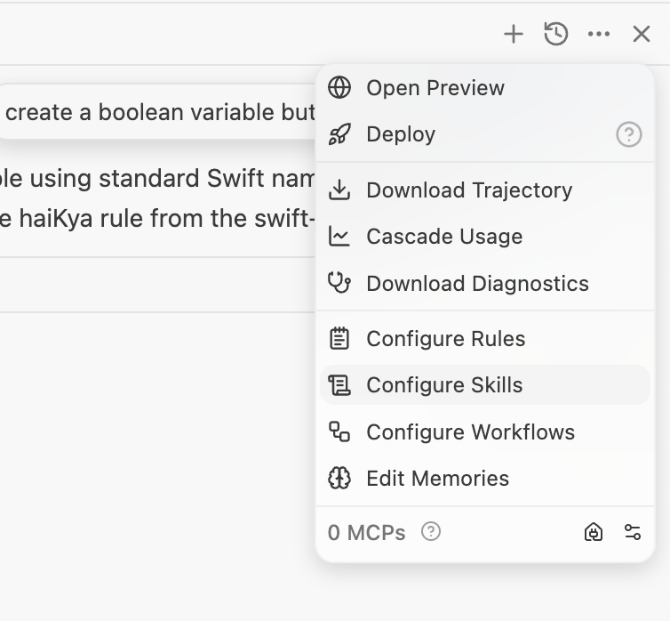
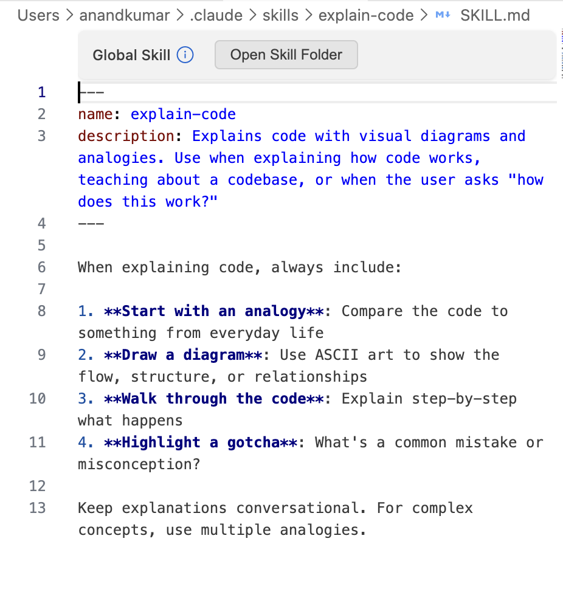
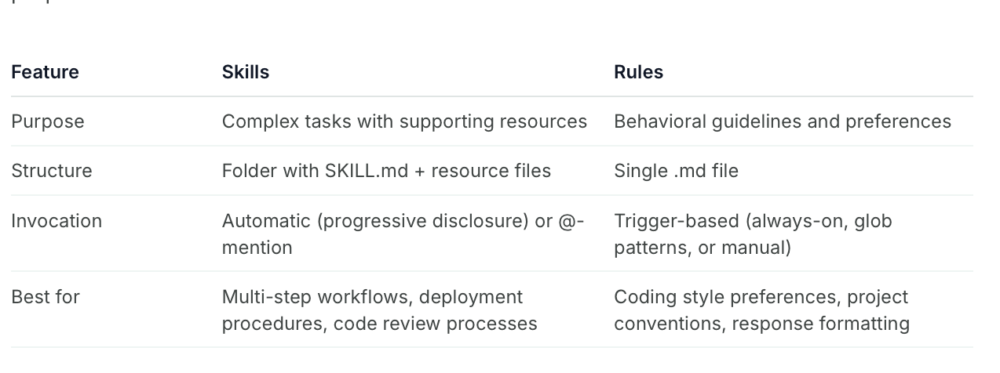

[toc]

[Documentation](https://docs.windsurf.com/windsurf/cascade/skills)

##### What is it

**Skills** are essentially pre-canned commands stored in a folder. The full specs for it are at https://agentskills.io/specification (its an industry-standard thing now, and pretty much the same as in Claude Code). Skills too can be at global level or workspace level.

Note that skills are used in a 'progressive disclosure' fashion, in the sense when the session starts only their name and description is loaded and not their full content. ([link](https://agentskills.io/what-are-skills#how-skills-work))

##### How to create skills

They can be created through UI or by directly creating the files in file system. From UI they can be created and managed from the same Cascade > Actions menu.

| Actions Menu                                                 | A sample skill                                               |
| ------------------------------------------------------------ | ------------------------------------------------------------ |
|  |  |

Or they can be created in a directory `~/.codeium/windsurf/skills/<skill-name>/ `.

##### Where are they located

Global skills - `~/.codeium/windsurf/skills/<skill-name>/ `   Workspace skills - `.windsurf/skills/<skill-name>/`

##### How to invoke a skill

Windsurf might invoke it automatically as per its inference, or you can invoke it explicitly through **@'skillname'** command in Cascade input.

##### Skills vs Rules

