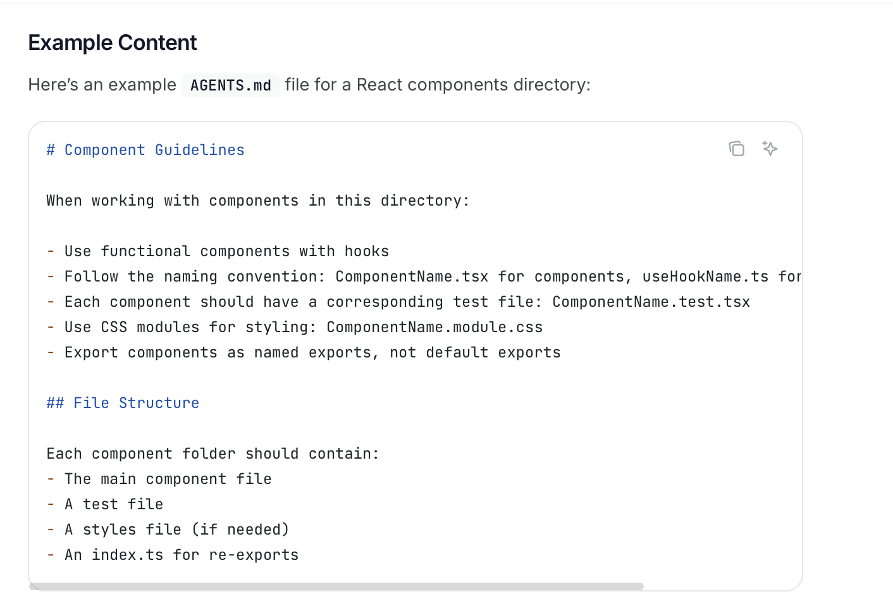
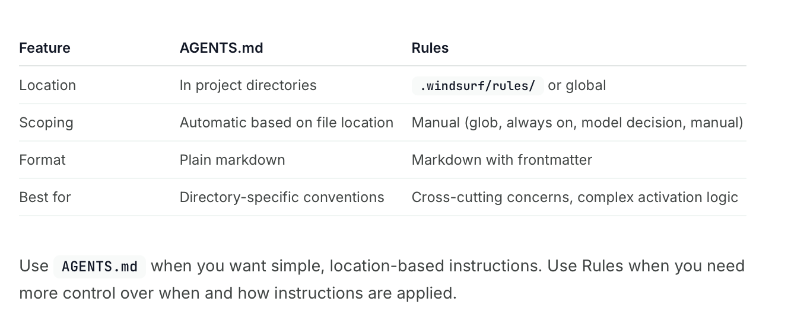

[toc]

[Documentation](https://docs.windsurf.com/windsurf/cascade/agents-md)

##### What is it

The content in **AGENTS.md** provides instructions that apply automatically in Cascade depending on the directory it is working with. When placed at the root of your workspace or git repository, the instructions apply globally to all files and when placed in a subdirectory, the instructions automatically apply only when working with files in that directory or its children

##### Sample AGENTS.md

Its a plain md file with no special frontmatter needed.

##### AGENTS.md vs Rules

AGENTS.md gives directory level control easily, but Rules can have more complex scoping filters.

