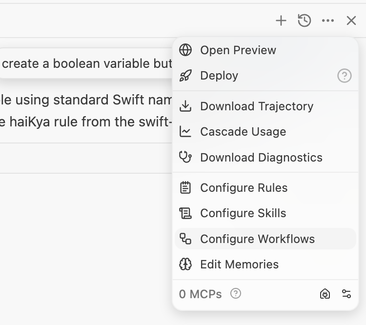
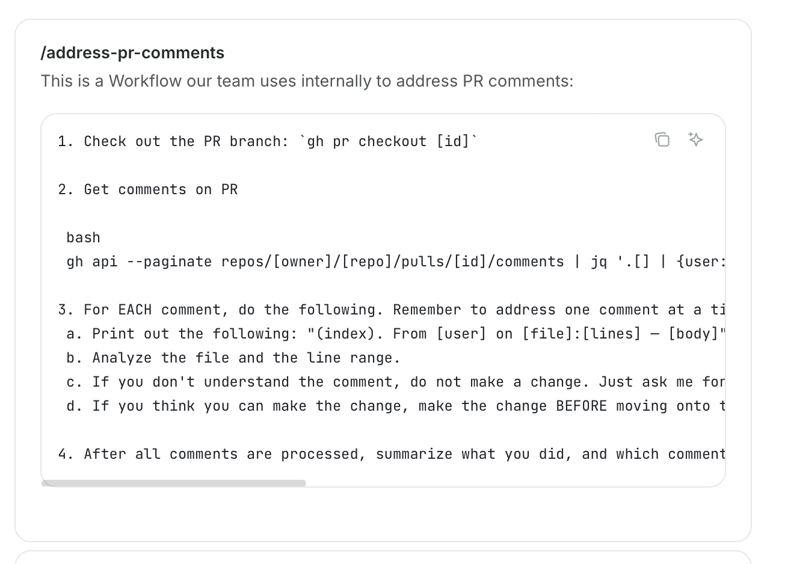
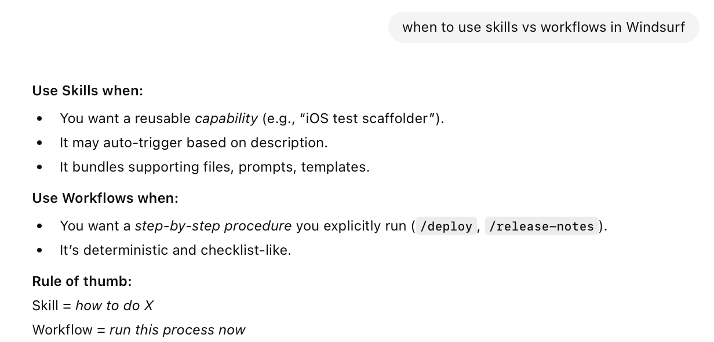
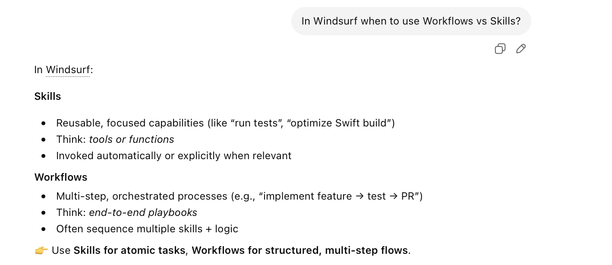

[toc]

[Documentation](https://docs.windsurf.com/windsurf/cascade/workflows)

##### What is it

Repeatable commands that are saved in markdown files and can be invoked with a slash command. Created from same Cascade > Actions menu

| Actions menu                                                 | A sample workflow                                            |
| ------------------------------------------------------------ | ------------------------------------------------------------ |
|  |  |

They are limited to 12000 characters each.

##### Where is it located

`.windsurf/workflows/` in your workspace directory and then can also be in any sub-directory.

Global workflows are probably saved in `~/.windsurf/workflows/`.

Enterprise can have system level workflows at `/Library/Application Support/Windsurf/workflows/*.md`.

##### Workflow vs Skills

Supposedly, workflows are for more determinstic things, and skills for more of prompt based inference. Or in another comparison workflow is for complicated things and skills for simpler. Pretty vague. 

