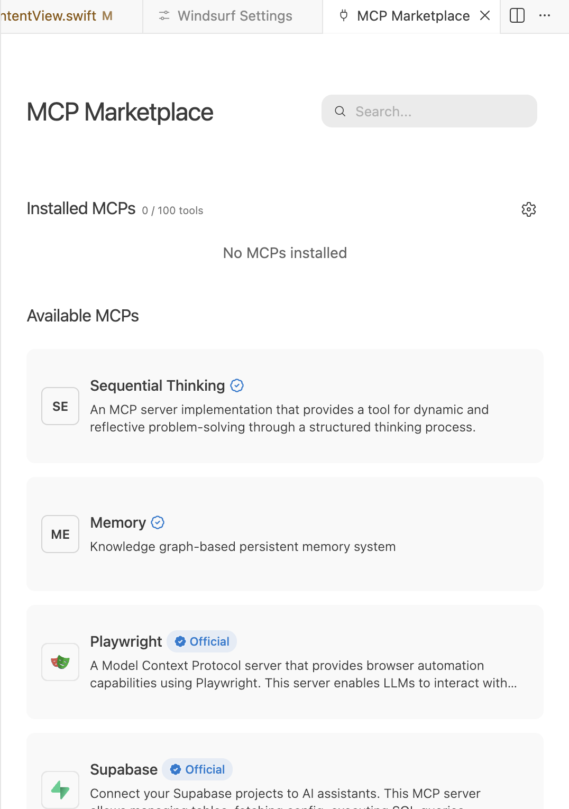
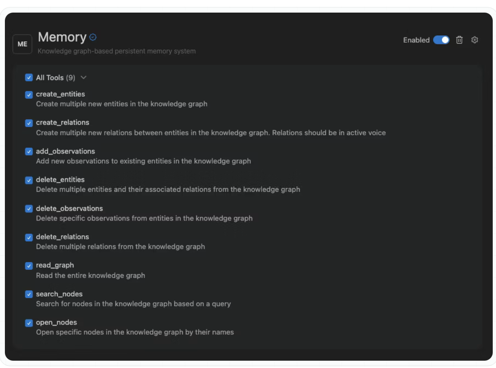

[toc]

[Documentation](https://docs.windsurf.com/windsurf/cascade/mcp)

##### MCP Markeplace, Adding MCP server

You can access MCP Marketplace from 'Windsurf Settings > Cascade > MCP Marketplace'  or 'Cascade chat > MCPs > MCP Markeplace '.

If you cannot find your desired MCP, you can add it manually by editing the raw `mcp_config.json` file. Can be done through Cascade chat > Actions menu.

##### mcp_config.json file

The **~/.codeium/windsurf/mcp_config.json** file is a JSON file that contains a list of servers that Cascade can connect to.

##### Configuring settings in an MCP connection

Every installed MCP connection has settings that can be configured.

