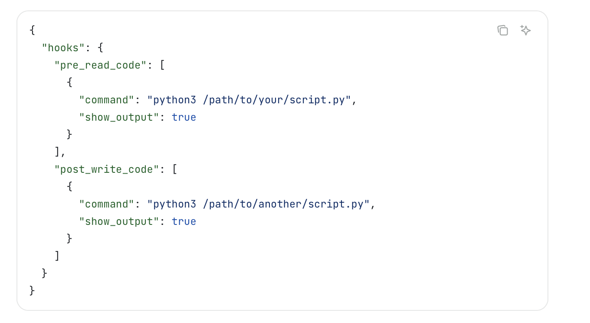
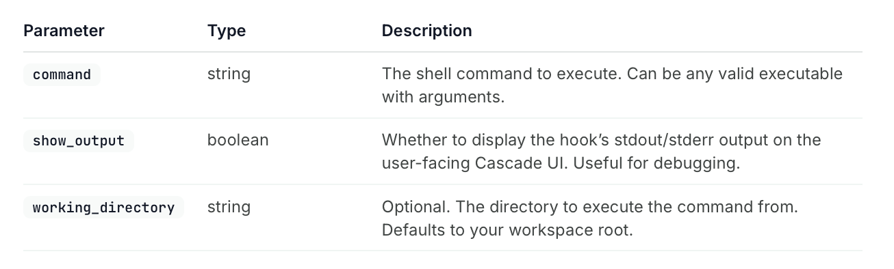
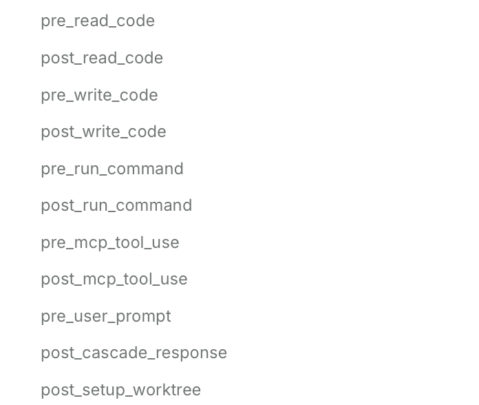
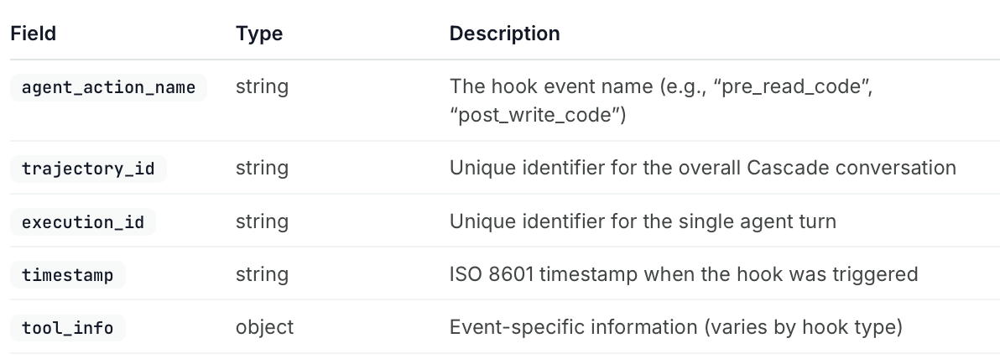
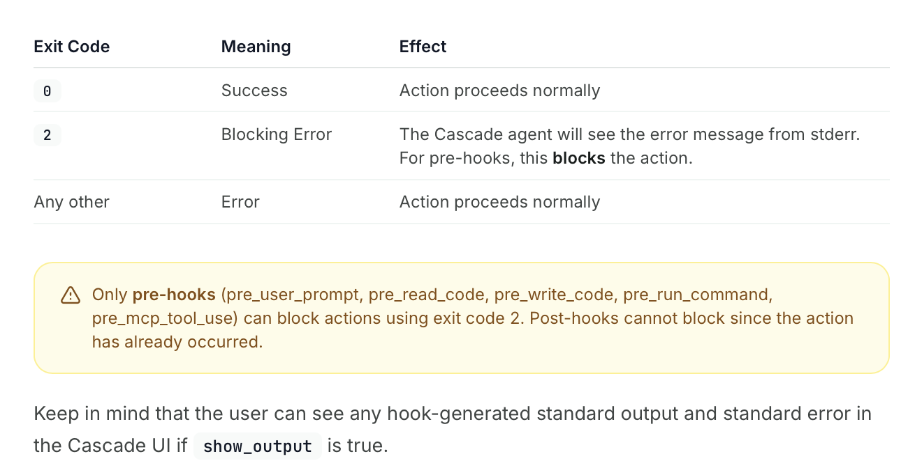

[toc]

##### What is it

**Hooks** allow to runcustom shell commands at key points in Cascade’s workflow. ([documentation](https://docs.windsurf.com/windsurf/cascade/hooks#exit-codes))

Event happens -> Script runs -> Result (exit code) returned

##### How to create

Save them in these files

System level - `/Library/Application Support/Windsurf/hooks.json`  User level - `~/.codeium/windsurf/hooks.json`  Workspace level - `.windsurf/hooks.json`

##### Sample hook

Following are the fields that a hook can have.

##### Hook Events

Things like these [Full list](https://docs.windsurf.com/windsurf/cascade/hooks#hook-events)

All hooks receive a JSON object with these things

##### Exit Codes

Your hook scripts communicate results through exit codes.

