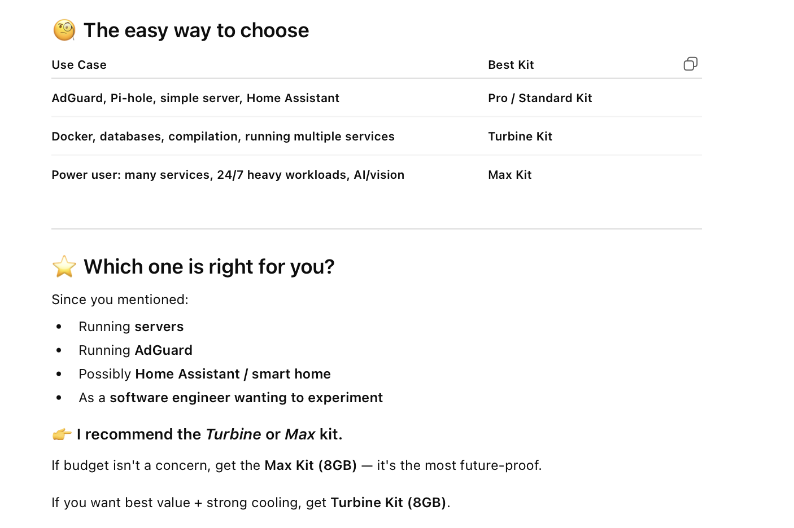

##### Starter Kit research

[ChatGPT link](https://chatgpt.com/c/692a1be9-ee3c-832b-b439-7b3277787c61)

##### My CanaKit Turbine model  

Raspberry Pi 5, 8 GB RAM, 2.4 GHz, Quad-Core CPU, 128 GB MircoSD Storage  Turbine Black Case, PWM Cooling Fan, Mega Heat Sink, 45W PD USB-C Power Supply

