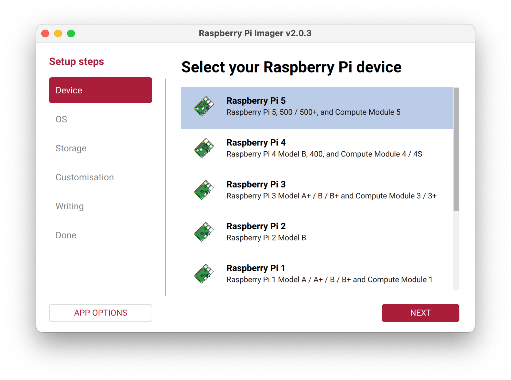
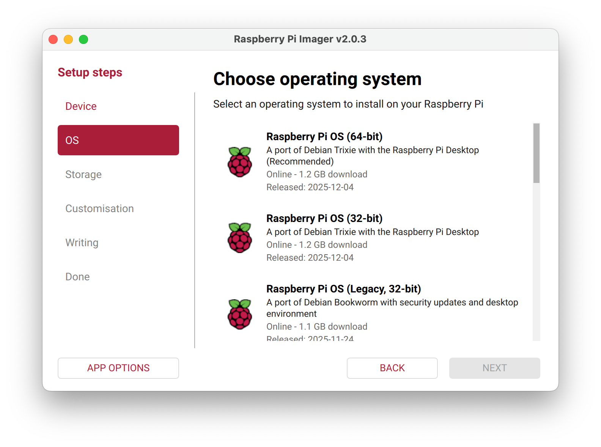
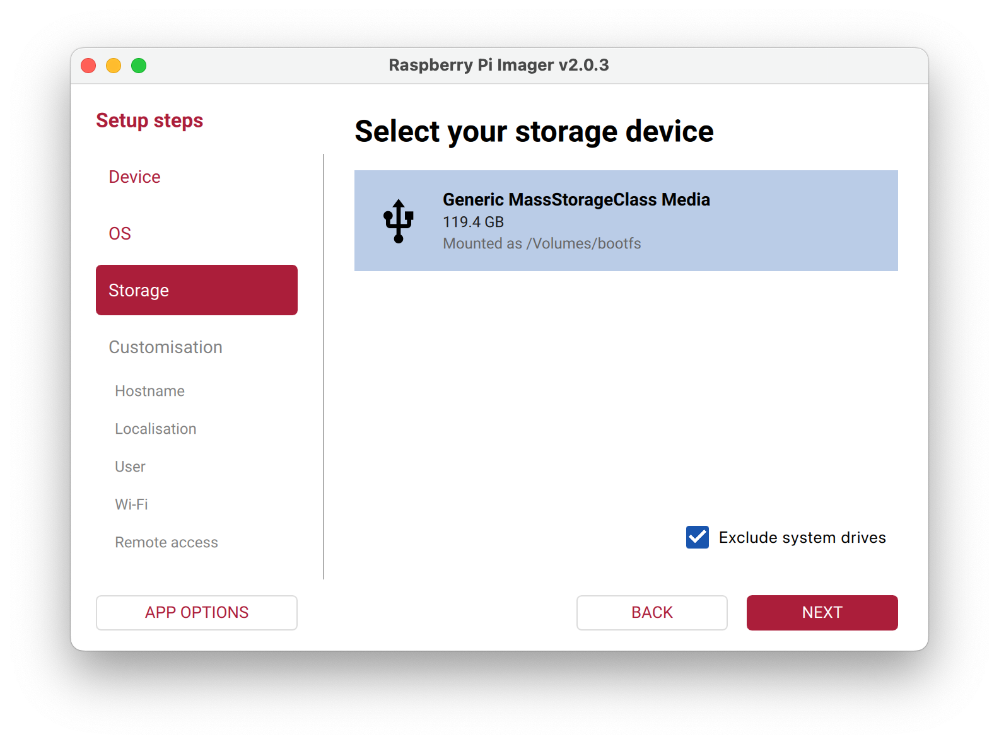
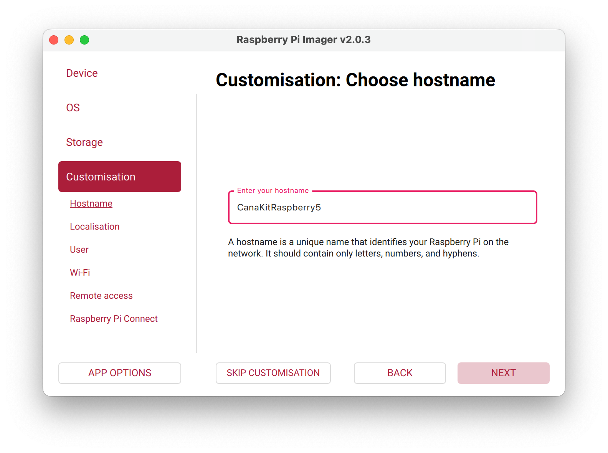
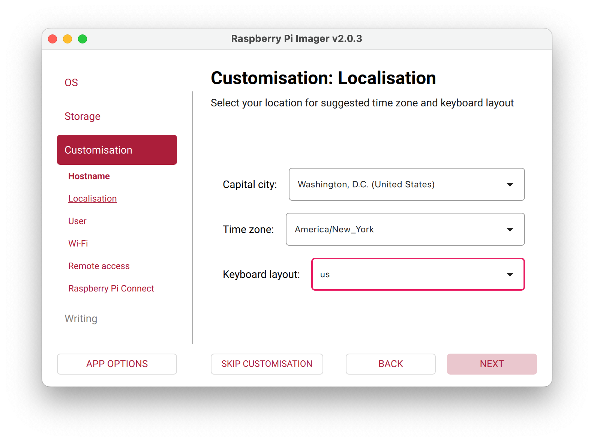
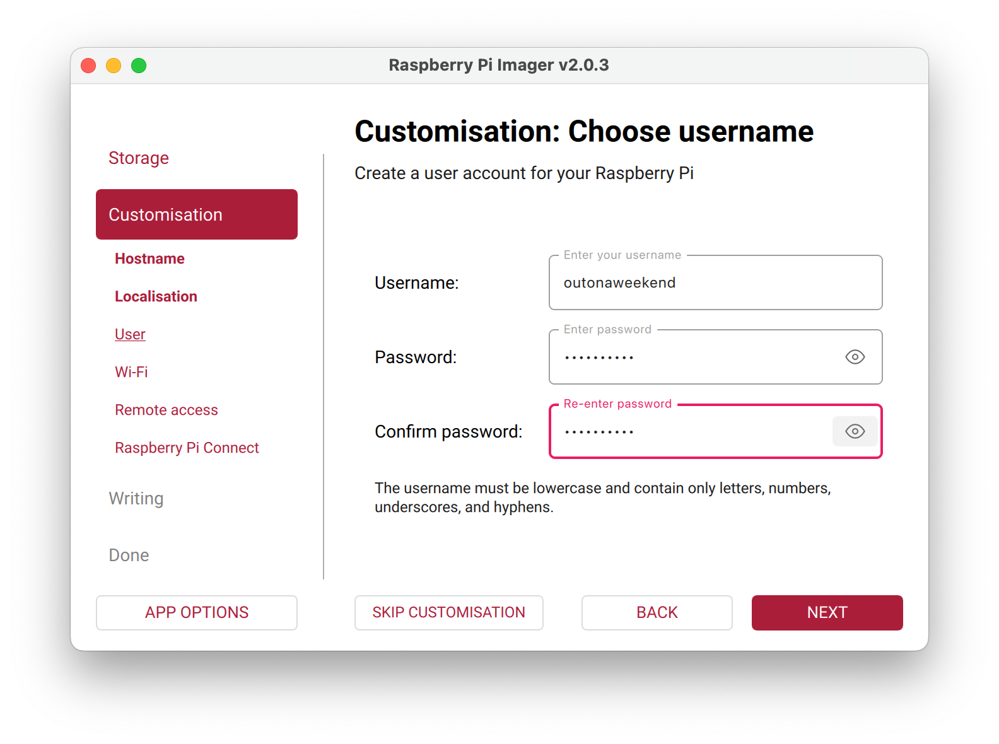
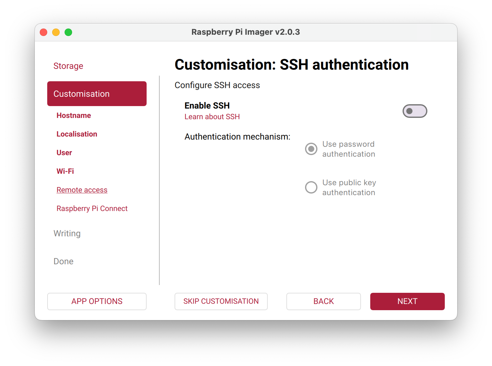
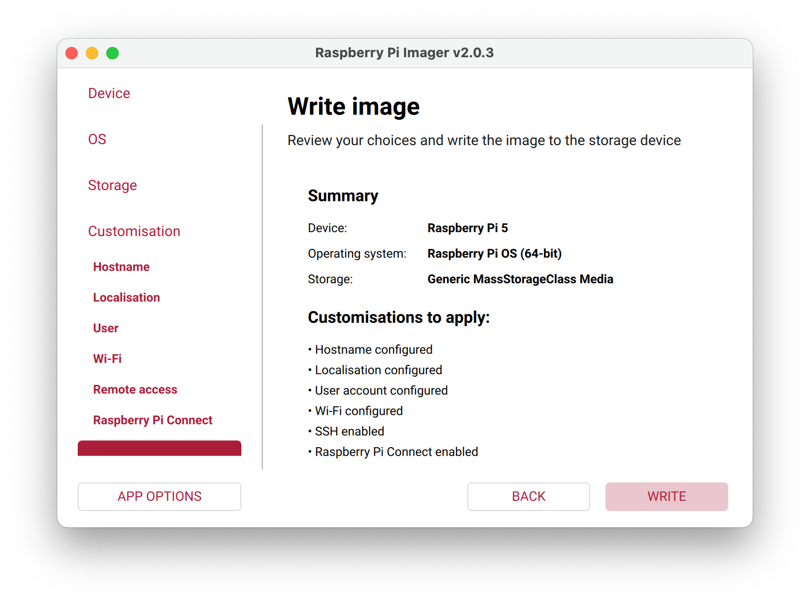
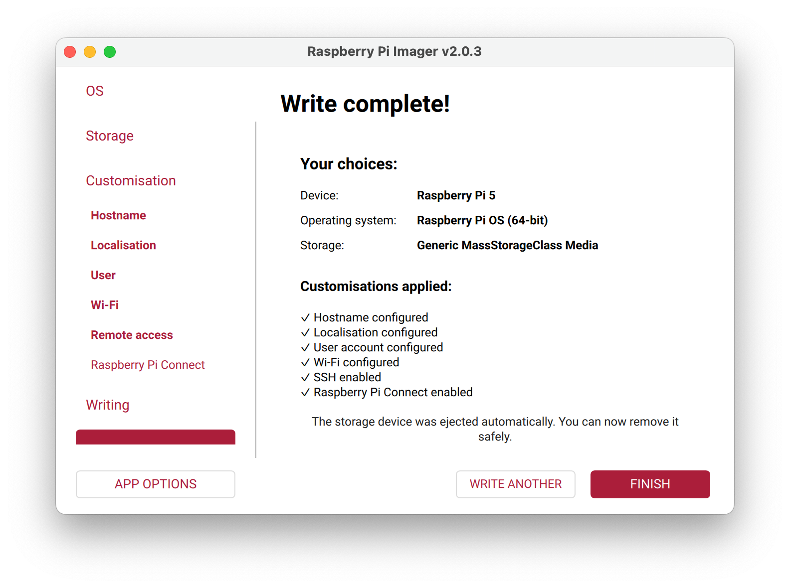

##### OS installation Steps

Installed the OS by putting the MicroSD card in a reader and connecting to my Mac, and then using **Raspberry Pi Imager** app

I installed **Raspberry Pi OS (64-bit)**. The **hostname** given is what is needed later for doing SSH from Mac. Also take care to remember the username and password (shown here) and the auth key created in the [website](https://connect.raspberrypi.com/settings#secret) (not shown here), they are needed later while doing SSH from Mac.

| Step 1 - Select device type      | 2. Select OS                     | Step 3 - Select actual device    |
| -------------------------------- | -------------------------------- | -------------------------------- |
|  |  |  |

| 4. Choose a hostname             | 5. Select language preference    | 6. Create user account           |
| -------------------------------- | -------------------------------- | -------------------------------- |
|  |  |  |

| 7. Setup SSH auth (don't skip)   | 8. Verify selections             | 9. OS installation completes     |
| -------------------------------- | -------------------------------- | -------------------------------- |
|  |  |  |

##### Resources

Setup/assembly - WagnerTech video ([link](https://www.youtube.com/watch?v=Wi_S7QkuN3Mj)) [Used this to assemble the kit the first time] , Addicted2Tech video ([link](https://www.youtube.com/watch?v=UMdgsOwI5aw)) [Used this for OS installation steps in Pi Imager app]  Unassembly case video ([link](https://www.youtube.com/watch?v=cZaEx16ziEs  )) [Used this to get the MicroSD card out]

