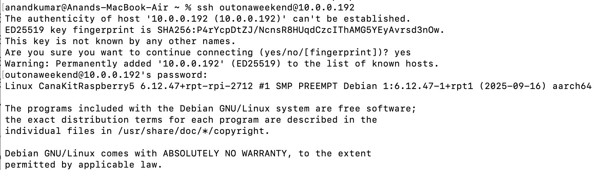
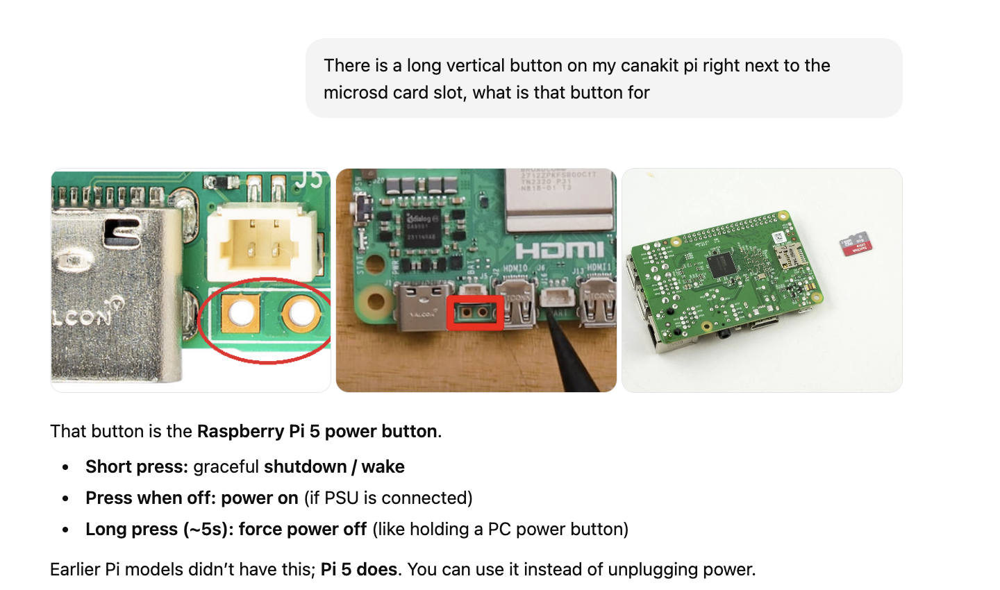

##### Connecting via SSH

ssh <username>@raspberrypi.local.

```
ssh canakitraspberry5@raspberrypi.local    # Haven't tried this yet though
```

If username is not known, you can also do username@IPAddress. For finding the IP address of the Pi, one way is to go to your router's mobile app/webpage and check the connected devices there.

```
ssh outonaweekend@10.0.0.192   # This is what I did and it worked
```

Official reference ([link](https://www.raspberrypi.com/documentation/computers/remote-access.html#ssh))



##### Disconnecting

Do not simply unplug, first do a shutdown via `sudo shutdown -h now` . LED will turn red, and then you can unplug.

> Probably pressing the **vertical power button** (next to MicroSD card) too does the same thing as that **shutdown** command.

##### Power button next to MicroSD card



##### Misc.

ChatGPT [link](https://chatgpt.com/g/g-p-694f63755778819194876e8385e1329d/c/694f6529-5d6c-832a-900f-b356a1d2bd74)