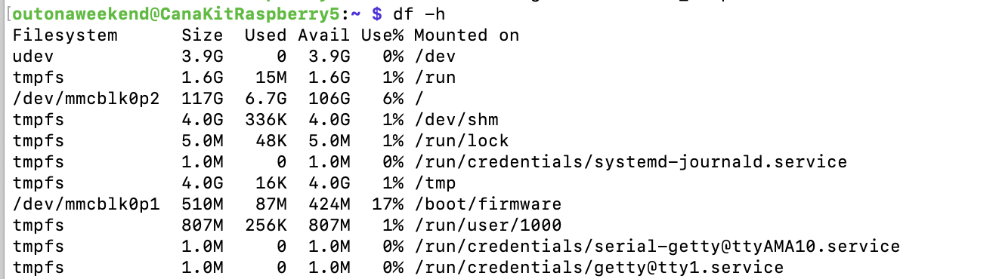
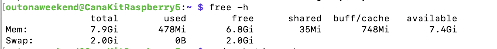

Is the OS piOS?

##### Raspberry Pi Ideas

Host web app, Camera, AI Kit, GPIO and sensors ([Sam Meech video](https://www.youtube.com/watch?v=Vp4glSVPT8o)) <br>Media storage and playback, Pi cluster for distributed computing, Hotspot, VPN, Home automation, Climate monitoring, Pi-hole ad blocking ([Jeff Geerling video](https://www.youtube.com/watch?v=rS9CbsohFGk&list=WL&index=52))

ChatGPT (12 29) [link](https://chatgpt.com/g/g-p-694f63755778819194876e8385e1329d-raspberry-pi/c/69533575-6540-832f-a04c-2bb7920a0ee3)

##### OS

**Raspberry PI OS** is based on **Debian**, which is a Linux distribution (i.e. built around Linux kernel). Debian was first released in 1993, Raspberry Pi OS was first released in 2012 (known as Raspbian back then, renamed to Raspberry Pi OS in 2020).

**apt** (Advanced Package Tool) is a general Linux package manager, which first originated in Debian. It is now used by Debian-based systems like Ubuntu, Linux Mint, Raspberry Pi OS.

```
sudo apt install git
```

##### Misc. commands

Check Pi temperature - `watch -n 1 vcgencmd measure_temp`

Check available storage - `df -h`



Check available RAM - `free -h`

