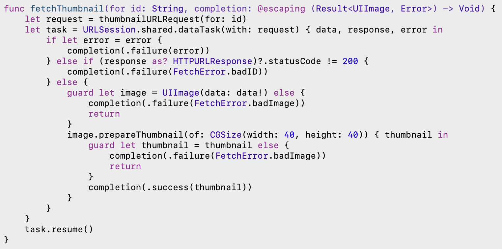
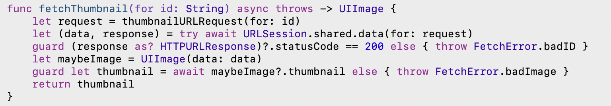

> The gist of the entire idea - That a function/thread's execution can be suspended indefinitely with an easy syntax.

##### Sample code snippet

Consider the following code snippet. This is the sequence of messages that it will log - `A1 B1 B2 A2 C1 D1 D3 D2 C2 true`.  

```
class ViewController: UIViewController {

    override func viewDidLoad() {
        super.viewDidLoad()
        print("A1")
        testMethod1()
        print("A2")
    }

    func testMethod1() {
        print("B1")
        Task { () -> Bool in
            print("C1")
            let result = await testMethod2()
            print("C2")
            print(result)
            return result
        }
        print("B2")
    }

    func testMethod2() async -> Bool {
        print("D1")
        let outcome = await withCheckedContinuation { (continuation: CheckedContinuation<Bool, Never>) in
            DispatchQueue.main.asyncAfter(deadline: .now() + 1.0) {
                print("D3")
                continuation.resume(returning: true)
            }
        }
        print("D2")
        return outcome
    }
}
```

`Task` acts like a closure that runs in a different thread, and the passed closure can return something (as specified in its return type). Its not clear though what happens to this returned value. <br>
It is basically a unit of asynchronous task that it can be send to the system for immediate execution on the next available thread, like the async function on a global dispatch queue. Its a common way to put awaitable function calls in a function that otherwise is not marked as an async function.
> TLDR - `Task` provides an easy context for including async code.

`await` suspends execution on the current thread until the called async function gives control back to it.

`withCheckedContinuation` too suspends the current task, then calls the given closure with a checked continuation for the current task. This checked continuation however has a way to itself return something and unsuspend the execution.

If the closure can return error too, `withCheckedThrowingContinuation` needs to be used. When the closure returns the outcome, `resume` needs to be called on the Continuation exactly once. `resume` basically provides the missing link to unsuspend any calls awaiting the result of the async function.
> If however `resume` is called twice, its a runtime error.

```
let outcome = await withCheckedContinuation { (continuation: CheckedContinuation<Bool, Never>) in
    DispatchQueue.main.asyncAfter(deadline: .now() + 1.0) {
        print("D3")
        continuation.resume(returning: true)
    }
}
```

-----------

These are not literally the same thing. The former function returns something right away, but the latter will not hand the execution back to caller right away (it will suspend the execution). The latter version however does ensure that something is mandatorily returned on completion (which couldn't be enforced by compiler in the former version, as its syntactically fine to not call the completion handler at all).

Using completion handler | Using async/await
--- | ---
 | 

If a function is marked as `async` what it means is that it may not return the execution back to caller right away, and the caller should account for it.

Once an await-able (i.e. async) function is called, the caller function suspends itself and the thread is freed up for system to do other work as it sees fit.

If the async function is a throwing function, while calling it can be handled using any varation of `try` (the `try` should prepend the `await`).
```
func func1() async throws {
    ...
    let a = try await func2()
    ...
}

```
-----------

Even computed properties can be async, but only if they are read-only. The getter needs to be qualified as `get async`, and the usual rules apply (like the body needs to call an async thing itself).

```
extension UIImage {
    var thumbnail: UIImage? {
        get async {
            let size = CGSize(width: 40, height: 40)
            return await self.byPreparingThumbnail(ofSize: size)
        }
    }
}
```

-----------

Async sequences

What probably happens here is that in every iteration the vending of new element is an awaitable task`. Once the element is vended, it thereafter resumes either with the process of vending the next element or if no element is left then beyond the loop.

```
for await id in staticImageIDsURL.lines {
    let thumbnail = await fetchThumbnail(for: id)
    collage.add(thumbnail)
}
```

-----------

Testing using XCTestExpectation | Testing using async/await
--- | ---
 | 

So one shortcoming is that a wait time cannot be specified in this way.
