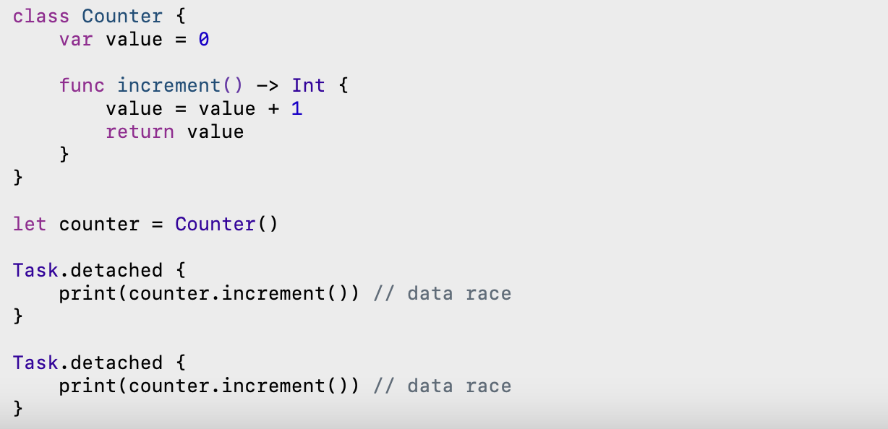
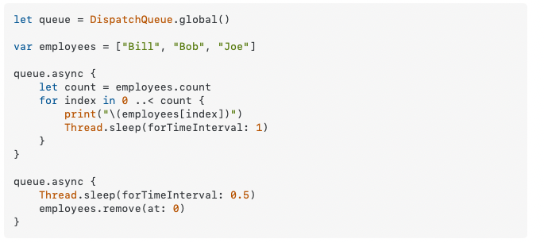

Random - Queues are an abstraction over threads.

#### Protect mutable state with Swift actors

##### Data races

Data races occur when two separate threads concurrenty access the same data and at least one of them is a 'write'.

Sample data race -
Sometimes it may print `2 1` or even `1 1`. That will happen if one read access reaches the instance before the other update has happened.
> I haven't quite been able to recreate a data race with this code snippet, but this is indeed supposed to be a legit potential data race code.



One way to avoid data races is to eliminate shared mutable state by using value semantics. With a variable of a value type, all mutation is local.

Its a minsomer to think that using value types gurantees that every thread will get its own copy of the data. Its not true, some value types are guranteed and some (like arrays) are not. However, there exist easy ways to have every thread get its own copy of certain value types.

Capture lists help. (No need of a `weak`, etc. prefix here as its a value type.)

([Stackoverflow explanation](https://stackoverflow.com/a/41351166/1135417))

Causes crash because of non-thread-safe code  | The right way to get a copy of the value type
--- | ---
 | 

> Non thread safe code means the same piece of data can be accessed by multiple threads at the same time. This can lead to bugs and more serious things.

##### Synchronization techniques

Various synchronization primitives exist - Atomics, Locks, Serial dispatch queues.

Actors are another mechanism (for shared mutable state to be precise) that is supposeduly easier to use. An actor has its own state and that state is isolated from the rest of the program. The only way to access that state is by going through the actor. It ensures that no other code is concurrently accessing the actor's state.

Actors are a new type and they too have properties, methods, initializers, subscripts, etc. Like classes, they are reference types because the essential purpose of actors is to express shared mutable state. Needs an `await` as well during usage.

```
actor Counter {
    var value = 0

    func increment() -> Int {
        value = value + 1
        return value
    }
}

let counter = Counter()

Task.detached {
    print(await counter.increment())
}

Task.detached {
    print(await counter.increment())
}
```

Actors ensure that only one task (Task?) can access it at a time (and they suspend the extra tasks for that time?).

Synchronous code on the actor always runs to completion without being interrupted.

Check your actor state assumptions after await.

##### Actor isolations

Actors conform to protocols.
`nonisolated` means that this method is treated as being outside the actor, even though it is, syntactically, described on the actor. They cannot refer mutable state on the actor.

```
actor LibraryAccount {
    let idNumber: Int
    var booksOnLoan: [Book] = []
}

extension LibraryAccount: Hashable {
    nonisolated func hash(into hasher: inout Hasher) {
        hasher.combine(idNumber)
    }
}
```

A Sendable type is one whose values can be shared across different actors.
