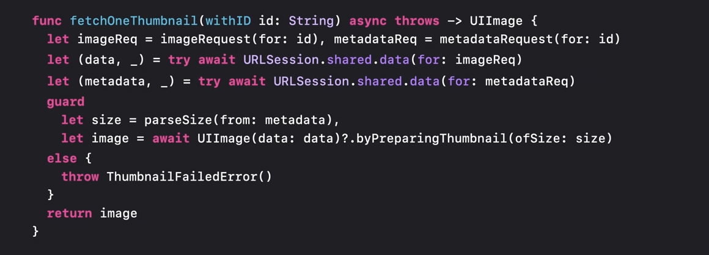
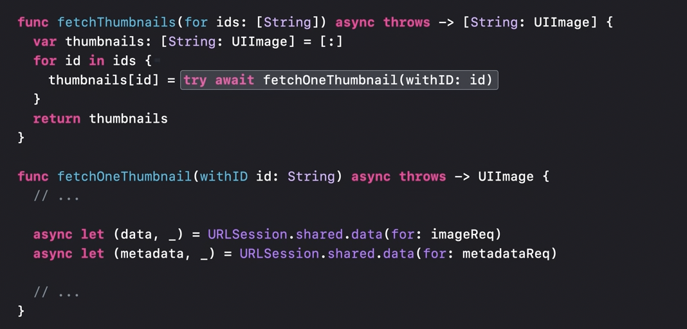
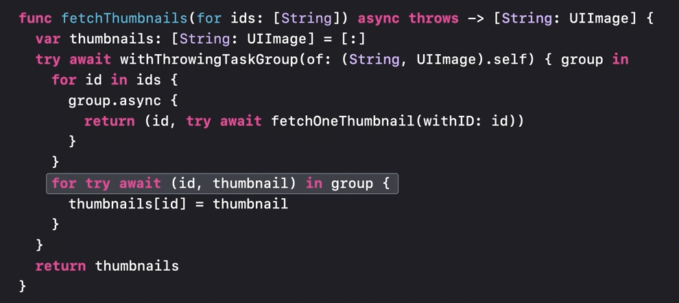

Concurrent binding with async let

Concurrent binding overcomes one shortcoming of typical use of async await (is that called sequential binding?). Using it, when an async function is called the caller thread does not suspend and yet when a point comes that something returned by the async function actually needs to be used it does suspend.

```
async let (data, _) = URLSession.shared.data(for: imageReq)
```

Sequential binding | Concurrent binding
--- | ---
 | 

So here when `async let (data, _) - ` is encountered, the async function gets called and yet the current thread continues execution and later when a point comes where `data` is being used its actually suspended. Also, that is where a `try` is needed to catch any error that might be thrown.

In case of concurrent binding, two tasks exist. One child task actually runs the async function and the other task is the same as the one that was executing the preceding statements.

----

Whenever a call is made from one async function to another the same task is used to execute the call. However when creating a new structured task like with async-let, it becomes the child of the task that the current function is running on.
Tasks are not the child of a specific function, but their lifetime may be scoped to it.

Task tree. The tree is made up of links between each parent and its child tasks. A link enforces a rule that says a parent task can only finish its work if all of its child tasks have finished. The task tree influences some important attributes of its tasks, like cancellation, priority, and task-local variables. A link enforces a rule that says a parent task can only finish its work if all of its child tasks have finished.

Marking a task as canceled does not stop the task. It simply informs the task that its results are no longer needed. <br>
When a task is canceled, all subtasks that are descendents of that task will be automatically canceled too.

Checking the cancellation status of current task -
```
if Task.isCancelled { ... }

try Task.checkCancellation()
```

----

Task Groups

In the former example, every iteration of the for loop can only start once the previous iteration has completed. In the latter example though, (because of task group), multiple iterations can run simulatenously.

Without task groups |  With task groups
--- | ---
 | 

Tasks added to a group cannot outlive the scope of the group in which the task is defined. Once added to a group, child tasks begin executing immediately and in any order. When the group object goes out of scope, the completion of all tasks within it will be implicitly awaited.

Whenever you create a new task, the work that the task performs is within a new closure type called a `@Sendable` closure.

All tasks can be cancelled before exiting the block using the group’s `cancelAll()` method.

----

Unstructured tasks

A handy thing to use when an async code needs to be called from a non-async context.

> Watch this part (from 18:45) again after watching the 'Protect mutable state with Swift actors' video and learning about @MainActor. After that the video talks about Detached tasks, watch that too.

-----


