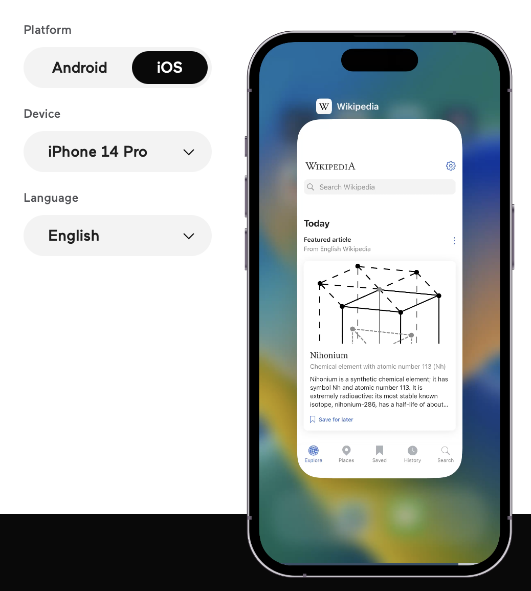

[toc]

Charles Proxy ([ChatGPT](https://chatgpt.com/c/69f1468d-0644-83ea-b065-b4194e025167))  Keyboard tracking ([ChatGPT](https://chatgpt.com/c/69f293e8-dae4-83ea-9f75-b72419634a80))  server-sim ([ChatGPT](https://chatgpt.com/c/69f54c3b-4c58-83ea-81dc-6147b6a44b16))

#### Open Source

##### swift-syntax related

A bunch of projects that use [swift-syntax](https://github.com/apple/swift-syntax/tree/main/Examples).

[SwiftLint](https://github.com/realm/SwiftLint) - Code formatting  [Swift AST Explorer](https://swift-ast-explorer.com/) - Live AST visualization of source code  [Swift Stress Tester](https://github.com/apple/swift-stress-tester) - Helps find reproducible crashes and other failures in tools that process Swift source code, such as the Swift compiler and SourceKit.  [SwiftGen](https://github.com/SwiftGen/SwiftGen) - Automatically generates Swift code for resources of your projects (like images, localised strings, etc), to make them type-safe to use.

##### OpenAPI related

[swift-openapi-generator](https://github.com/apple/swift-openapi-generator) - Generates model entities (both client side and server side) from an OpenAPI spec. ([WWDC video](https://developer.apple.com/videos/play/wwdc2023/10171/), [Marco Eidinger article](https://blog.eidinger.info/generate-restful-apis-with-swift-in-2023)) [yonaskolb/SwagGen](yonaskolb/SwagGen) - Generating model entities and parser from an OpenAPI spec (not actively developed since SwiftOpenAPI generator was announced). [Quicktype](https://app.quicktype.io) - An online tool for generating model entities (in many manguages including Swift) from a JSON.

##### Misc.

[jpsim/yams](https://github.com/jpsim/Yams) - Swift YAML parser

#### New Things

##### WebAssembly

`WebAssembly` is a high-performance assembly-like language that can be compiled from various languages, including C/C++, Rust, and AssemblyScript. It is supported by Chrome, Firefox, Safari, Edge, and Node.js. 

It has  wo file formats, a binary format called a WebAssembly Module with a `.wasm` extension and corresponding text representation called WebAssembly Text format with a `.wat` extension.

How to use it with Node ([link](https://nodejs.org/en/learn/getting-started/nodejs-with-webassembly))

#### How does that happen

##### Appetize

How does [Appetize](https://appetize.io) embed a Android emulator/iOS simulator in a web page. What technology/stack is at play there.

