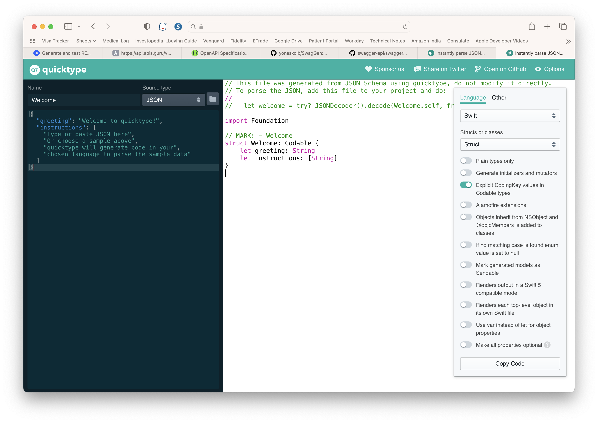

##### swift-syntax related

A bunch of projects that use [swift-syntax](https://github.com/apple/swift-syntax/tree/main/Examples).

[SwiftLint](https://github.com/realm/SwiftLint) - Code formatting  [Swift AST Explorer](https://swift-ast-explorer.com/) - Live AST visualization of source code  [Swift Stress Tester](https://github.com/apple/swift-stress-tester) - Helps find reproducible crashes and other failures in tools that process Swift source code, such as the Swift compiler and SourceKit.  [SwiftGen](https://github.com/SwiftGen/SwiftGen) - Automatically generates Swift code for resources of your projects (like images, localised strings, etc), to make them type-safe to use.

##### OpenAPI related

[swift-openapi-generator](https://github.com/apple/swift-openapi-generator) - Generates model entities (both client side and server side) from an OpenAPI spec. ([WWDC video](https://developer.apple.com/videos/play/wwdc2023/10171/), [Marco Eidinger article](https://blog.eidinger.info/generate-restful-apis-with-swift-in-2023)) [yonaskolb/SwagGen](yonaskolb/SwagGen) - Generating model entities and parser from an OpenAPI spec (not actively developed since SwiftOpenAPI generator was announced). [Quicktype](https://app.quicktype.io) - An online tool for generating model entities (in many manguages including Swift) from a JSON.

